---
## Front matter
lang: ru-RU
title: Лабораторная работа №1
subtitle: Операционные системы
author:
  - Мурашов И. В., НКАбд-04-23
institute:
  - Российский университет дружбы народов, Москва, Россия
  
date: 19 февраля 2024

## i18n babel
babel-lang: russian
babel-otherlangs: english

## Formatting pdf
toc: false
toc-title: Содержание
slide_level: 2
aspectratio: 169
section-titles: true
theme: metropolis
header-includes:
 - \metroset{progressbar=frametitle,sectionpage=progressbar,numbering=fraction}
 - '\makeatletter'
 - '\beamer@ignorenonframefalse'
 - '\makeatother'
 
## Fonts
mainfont: PT Serif
romanfont: PT Serif
sansfont: PT Sans
monofont: PT Mono
mainfontoptions: Ligatures=TeX
romanfontoptions: Ligatures=TeX
sansfontoptions: Ligatures=TeX,Scale=MatchLowercase
monofontoptions: Scale=MatchLowercase,Scale=0.9
---

## Докладчик

:::::::::::::: {.columns align=center}
::: {.column width="70%"}

  * Мурашов Иван Вячеславович
  * Cтудент, 1 курс, группа НКАбд-04-23
  * Российский университет дружбы народов
  * [1132236018@rudn.ru](mailto:1132236018@rudn.ru)
  * <https://github.com/neve7mind>

:::
::: {.column width="30%"}

:::
::::::::::::::

## Цель работы

Целью данной работы является приобретение практических навыков установки операционной системы на виртуальную машину и настройки минимально необходимых для дальнейшей работы сервисов.

## Выполнение лабораторной работы

Для работы в ОС Linux я скачал файл ISO для системы Intel (Fedora Workstation 39).

## Выполнение лабораторной работы

Настраиваю хост-комбинацию, ставлю Right Ctrl.

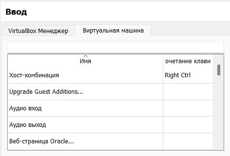

## Выполнение лабораторной работы

Нажимаю "Создать виртуальную машину" в VirtualBox Manager. Задаю имя, папку для виртуальной машины, прикрепляю образ ISO.

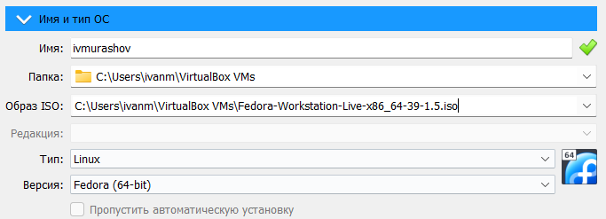

## Выполнение лабораторной работы

В разделе "Оборудование" задаю 8096 Мб основной памяти и 4 ядра процессора .

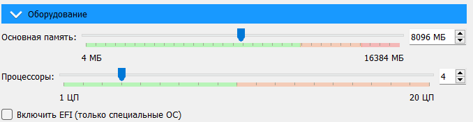

## Выполнение лабораторной работы

В разделе "Жёсткий диск" создаю виртуальный жёсткий диск, выделяя на него 90 Гб.

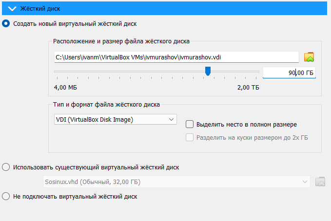

## Выполнение лабораторной работы

В разделе "Общие" настраиваю двунаправленный буфер обмена и функцию Drag'n'Drop.

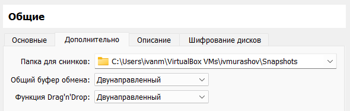

## Выполнение лабораторной работы

В разделе "Дисплей" выделяю 64 Мб на видеопамять.

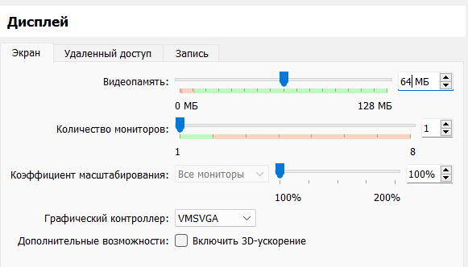

## Выполнение лабораторной работы

Запускаю виртуальную машину, настраивая язык, дату и время и указывая место установки (автоматически).

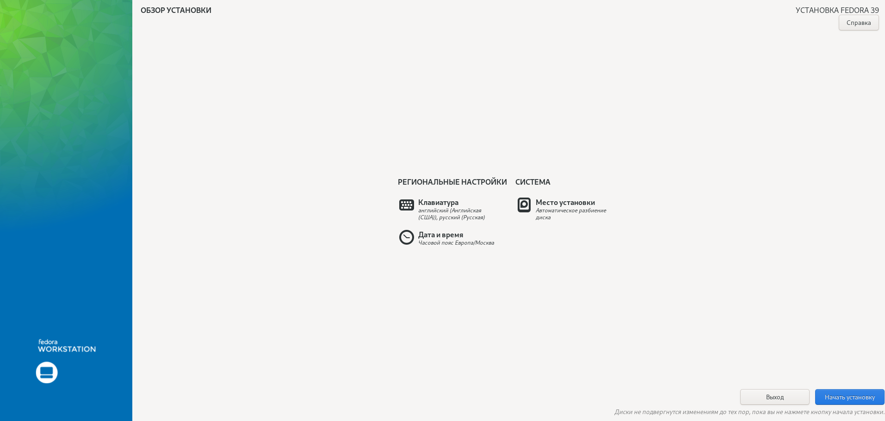

## Выполнение лабораторной работы

Внутри операционной системы добавляю польззователя.

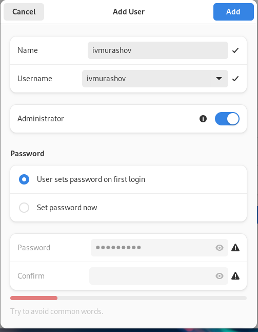

## Выполнение лабораторной работы

Открываю терминал и переключаюсь на роль супер-пользователя с помощью команды 'sudo -i' и обновляю все пакеты.

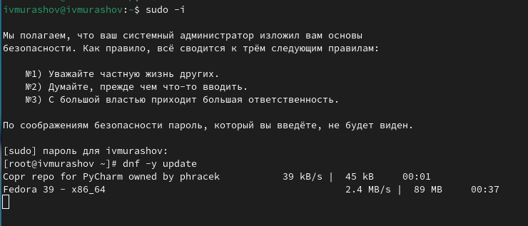

## Выполнение лабораторной работы

Устанаваливаю программы для удобства работы в консоли (оболочка tmux и mc в качестве файлового менеджера).

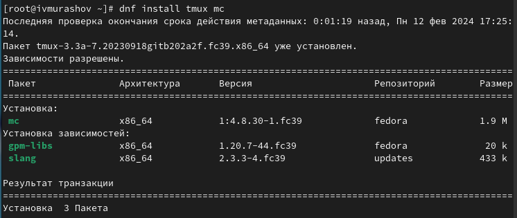

## Выполнение лабораторной работы

Для использования автоматического обновления устанавливаем необходимое программное обеспечение (dnf-automatic).

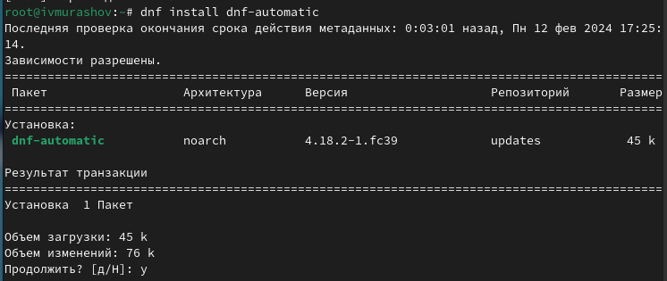

## Выполнение лабораторной работы

Задаю необходимую конфигурацию в файле /etc/dnf/automatic.conf и запускаю его.

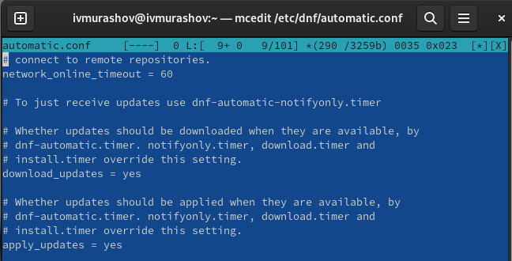

## Выполнение лабораторной работы

Перезагружаю виртуальную машину.

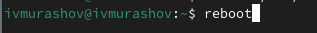

## Выполнение лабораторной работы

В файле /etc/selinux/config заменяю значение SELINUX=enforcing на значение SELINUX=permissive и перезагружаю машину.

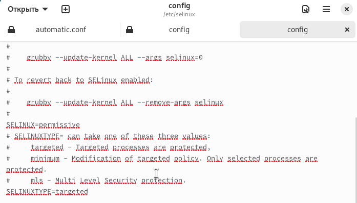

## Выполнение лабораторной работы

В режиме супер-пользователя устанавливаю пакет DKMS.

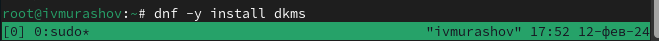

## Выполнение лабораторной работы

В меню виртуальной машины подключаю образ диска дополнений гостевой ОС.

## Выполнение лабораторной работы

Подмонтирую диск.

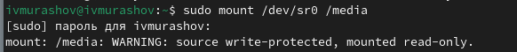

## Выполнение лабораторной работы

Устанавливаю драйвера и перезагружаю виртуальную машину.

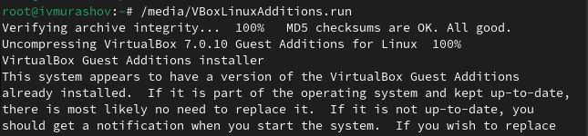

## Выполнение лабораторной работы

Запускаю терминальный мультиплексор tmux и в режиме супер-пользователя редактирую конфигурационный файл /etc/X11/xorg.conf.d/00-keyboard.conf и перезагружаю машину.

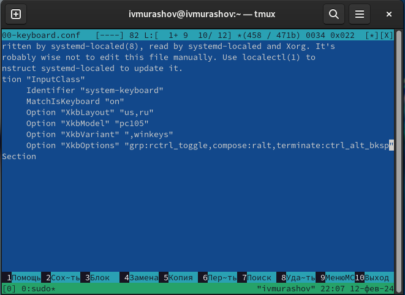

## Выполнение лабораторной работы

Запускаю терминальный мультиплексор tmux и в режиме супер-пользователя убеждаюсь в том, что пользователь уже создан.

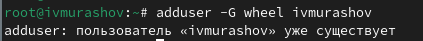

## Выполнение лабораторной работы

Настраиваю имя хоста и проверяю, что оно верно установлено.

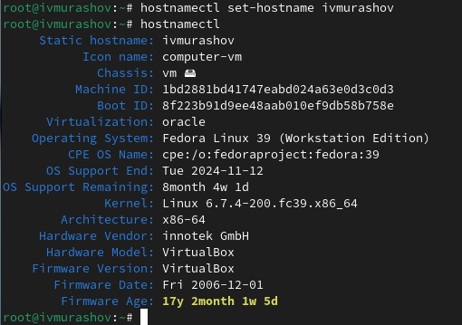

## Выполнение лабораторной работы

Для работы с перекрёстными ссылками я устанавливаю пакет pandoc-crossref последней версии.

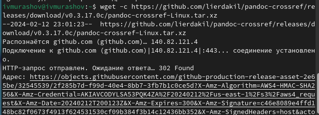

## Выполнение лабораторной работы

Нахожу в файловой системе скачанный файл в формате tar.gz.

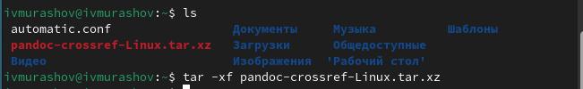

## Выполнение лабораторной работы

Распаковываю архив, устанавливаю права на запись и чтение, создаю каталог для данного программного обеспечения и перемещаю его в данный каталог.

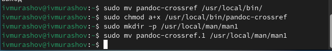

## Выполнение лабораторной работы

Просматриваю версию установленного pandoc-crossref и проверяю на соответствие ей версию pandoc.

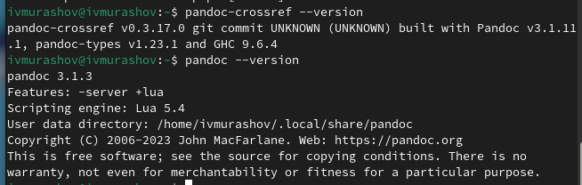

## Выполнение лабораторной работы

Устанавливаю дистрибутив TexLive.

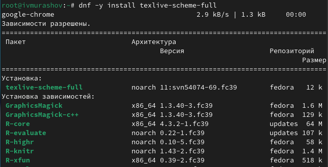

## Выполнение лабораторной работы

Получаю информацию о версии ядра Linux.

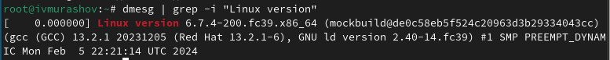

## Выполнение лабораторной работы

Получаю информацию о частоте процессора.

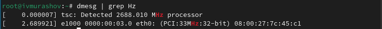

## Выполнение лабораторной работы

Получаю информацию о модели процессора.

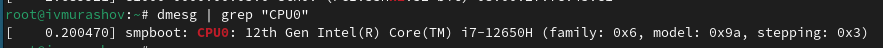

## Выполнение лабораторной работы

Получаю информацию об объёме доступной оперативной памяти в мегабайтах (free).

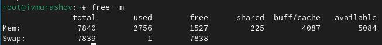

## Выполнение лабораторной работы

Получаю информацию о типе обнаруженного гипервизора.

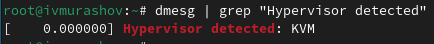

## Выполнение лабораторной работы

Получаю информацию о типе файловой системы корневого раздела.

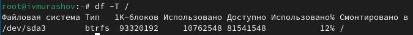

## Выполнение лабораторной работы

Получаю информацию о последовательности монтирования файловых систем.

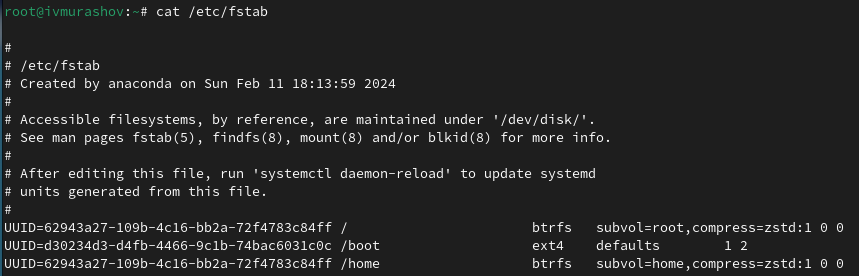

## Выводы

При выполнении данной лабораторной работы я приобрёл практические навыки установки операционной системы на виртуальную машину и настройки минимально необходимых для дальнейшей работы сервисов.

