---
## Front matter
title: "Отчёт по лабораторной работе №1"
subtitle: "Операционные системы"
author: "Мурашов Иван Вячеславович"

## Generic otions
lang: ru-RU
toc-title: "Содержание"

## Bibliography
bibliography: bib/cite.bib
csl: pandoc/csl/gost-r-7-0-5-2008-numeric.csl

## Pdf output format
toc: true # Table of contents
toc-depth: 2
lof: true # List of figures
lot: true # List of tables
fontsize: 12pt
linestretch: 1.5
papersize: a4
documentclass: scrreprt
## I18n polyglossia
polyglossia-lang:
  name: russian
  options:
	- spelling=modern
	- babelshorthands=true
polyglossia-otherlangs:
  name: english
## I18n babel
babel-lang: russian
babel-otherlangs: english
## Fonts
mainfont: PT Serif
romanfont: PT Serif
sansfont: PT Sans
monofont: PT Mono
mainfontoptions: Ligatures=TeX
romanfontoptions: Ligatures=TeX
sansfontoptions: Ligatures=TeX,Scale=MatchLowercase
monofontoptions: Scale=MatchLowercase,Scale=0.9
## Biblatex
biblatex: true
biblio-style: "gost-numeric"
biblatexoptions:
  - parentracker=true
  - backend=biber
  - hyperref=auto
  - language=auto
  - autolang=other*
  - citestyle=gost-numeric
## Pandoc-crossref LaTeX customization
figureTitle: "Рис."
tableTitle: "Таблица"
listingTitle: "Листинг"
lofTitle: "Список иллюстраций"
lotTitle: "Список таблиц"
lolTitle: "Листинги"
## Misc options
indent: true
header-includes:
  - \usepackage{indentfirst}
  - \usepackage{float} # keep figures where there are in the text
  - \floatplacement{figure}{H} # keep figures where there are in the text
---

# Цель работы

Целью данной работы является приобретение практических навыков установки операционной системы на виртуальную машину и настройки минимально необходимых для дальнейшей работы сервисов.

# Задание

1. Установка виртуальной машины
2. Работа в операционной системе
3. Установка программного обеспечения для создания документации
4. Выполнение заданий для домашней работы
5. Ответы на контрольные вопросы

# Выполнение лабораторной работы

## Установка виртуальной машины

Для работы в ОС Linux я скачал файл ISO для системы Intel (Fedora Workstation 39) (рис. [-@fig:001]).

{#fig:001 width=70%}

Настраиваю хост-комбинацию, ставлю Right Ctrl (рис. [-@fig:002]).

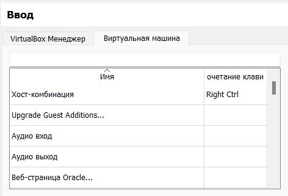{#fig:002 width=70%}

Нажимаю "Создать виртуальную машину" в VirtualBox Manager. Задаю имя, папку для виртуальной машины, прикрепляю образ ISO (рис. [-@fig:003]).

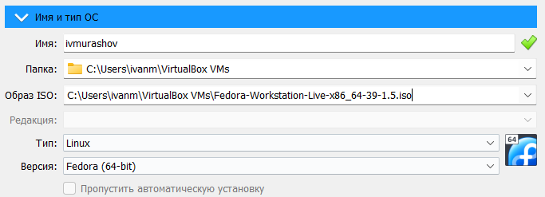{#fig:003 width=70%}

В разделе "Оборудование" задаю 8096 Мб основной памяти и 4 ядра процессора (рис. [-@fig:004]).

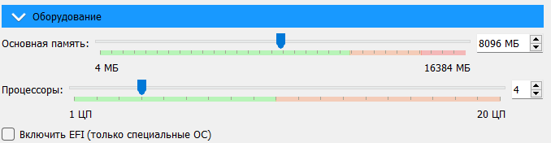{#fig:004 width=70%}

В разделе "Жёсткий диск" создаю виртуальный жёсткий диск, выделяя на него 90 Гб (рис. [-@fig:005]).

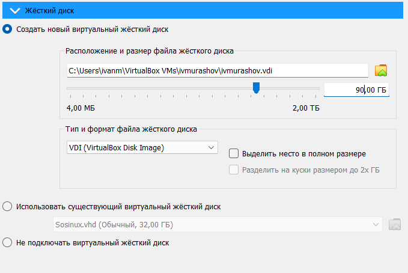{#fig:005 width=70%}

В разделе "Общие" настраиваю двунаправленный буфер обмена и функцию Drag'n'Drop (рис. [-@fig:006]).

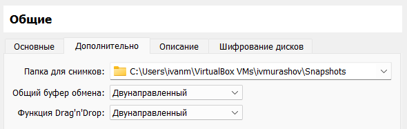{#fig:006 width=70%}

В разделе "Дисплей" выделяю 64 Мб на видеопамять (рис. [-@fig:007]).

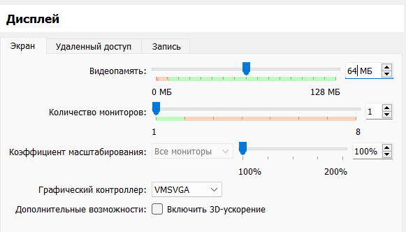{#fig:007 width=70%}

Запускаю виртуальную машину, настраивая язык, дату и время и указывая место установки (автоматически) (рис. [-@fig:008]).

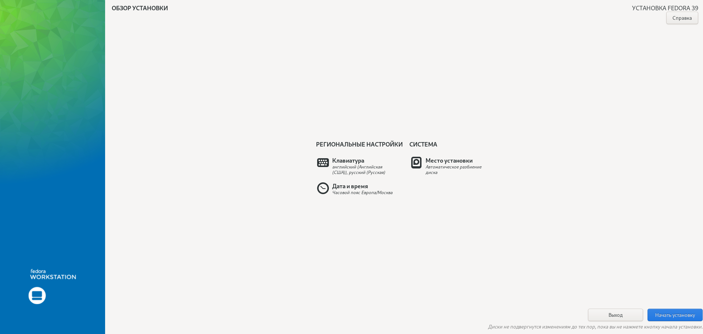{#fig:008 width=70%}

## Работа в операционной системе

Внутри операционной системы добавляю польззователя (рис. [-@fig:009]).

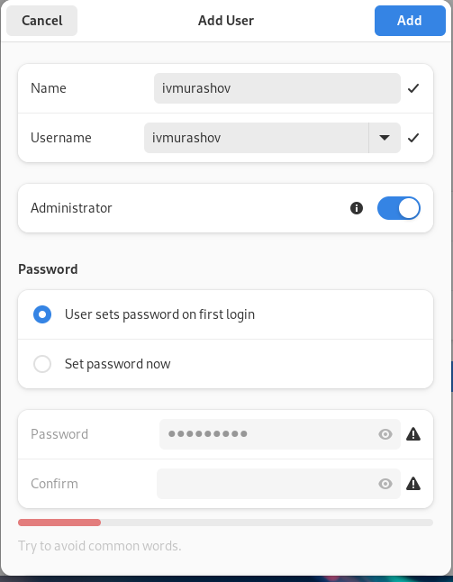{#fig:009 width=70%}

Открываю терминал и переключаюсь на роль супер-пользователя с помощью команды 'sudo -i' и обновляю все пакеты (рис. [-@fig:010]).

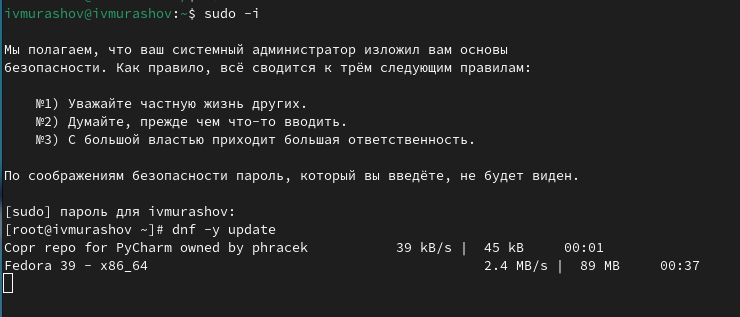{#fig:010 width=70%}

Устанаваливаю программы для удобства работы в консоли (оболочка tmux и mc в качестве файлового менеджера) (рис. [-@fig:011]).

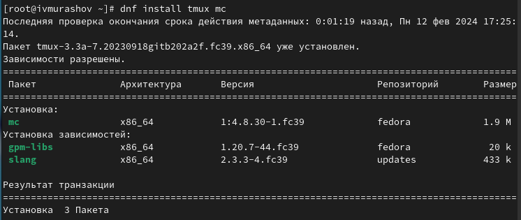{#fig:011 width=70%}

Для использования автоматического обновления устанавливаем необходимое программное обеспечение (dnf-automatic)
(рис. [-@fig:012]).

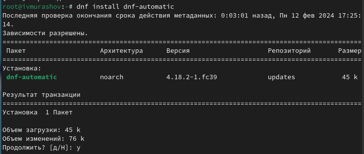{#fig:012 width=70%}

Задаю необходимую конфигурацию в файле /etc/dnf/automatic.conf и запускаю его(рис. [-@fig:013]).

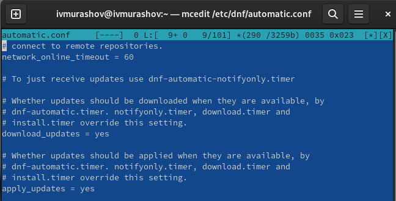{#fig:013 width=70%}

Перезагружаю виртуальную машину (рис. [-@fig:014]).

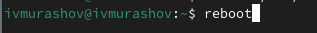{#fig:014 width=70%}

В файле /etc/selinux/config заменяю значение SELINUX=enforcing на значение SELINUX=permissive и перезагружаю машину (рис. [-@fig:015]).

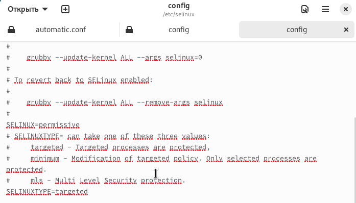{#fig:015 width=70%}

В режиме супер-пользователя устанавливаю пакет DKMS (рис. [-@fig:016]).

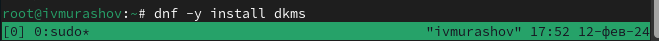{#fig:016 width=70%}

В меню виртуальной машины подключаю образ диска дополнений гостевой ОС (рис. [-@fig:017]).

{#fig:017 width=70%}

Подмонтирую диск (рис. [-@fig:018]).

{#fig:018 width=70%}

Устанавливаю драйвера и перезагружаю виртуальную машину (рис. [-@fig:019]).

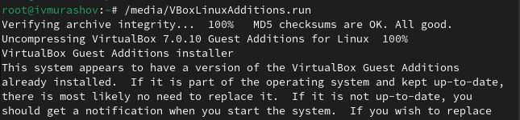{#fig:019 width=70%}

Запускаю терминальный мультиплексор tmux и в режиме супер-пользователя редактирую конфигурационный файл /etc/X11/xorg.conf.d/00-keyboard.conf и перезагружаю машину (рис. [-@fig:020]).

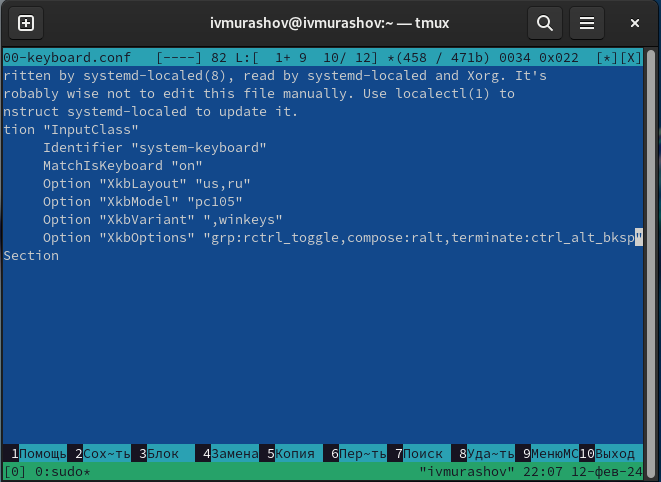{#fig:020 width=70%}

Запускаю терминальный мультиплексор tmux и в режиме супер-пользователя убеждаюсь в том, что пользователь уже создан (рис. [-@fig:021]).

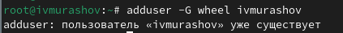{#fig:021 width=70%}

Настраиваю имя хоста и проверяю, что оно верно установлено (рис. [-@fig:022]).

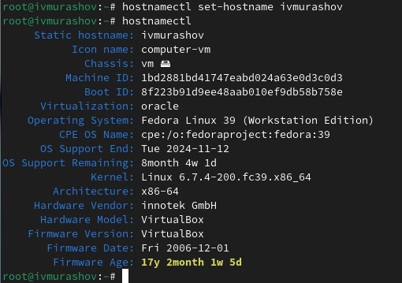{#fig:022 width=70%}

## Установка программного обеспечения для создания документации

Для работы с перекрёстными ссылками я устанавливаю пакет pandoc-crossref последней версии (рис. [-@fig:023]).

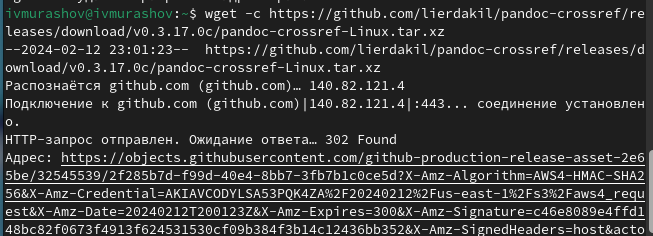{#fig:023 width=70%}

Нахожу в файловой системе скачанный файл в формате tar.gz (рис. [-@fig:024]).

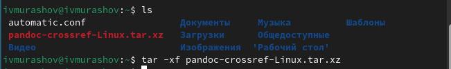{#fig:024 width=70%}

Распаковываю архив, устанавливаю права на запись и чтение, создаю каталог для данного программного обеспечения и перемещаю его в данный каталог (рис. [-@fig:025]).

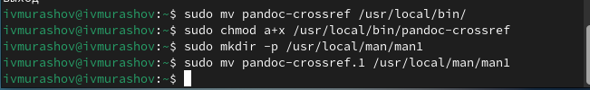{#fig:025 width=70%}

Просматриваю версию установленного pandoc-crossref и проверяю на соответствие ей версию pandoc (рис. [-@fig:026]).

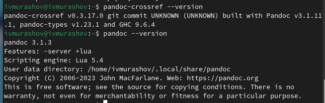{#fig:026 width=70%}

Устанавливаю дистрибутив TexLive (рис. [-@fig:027]).

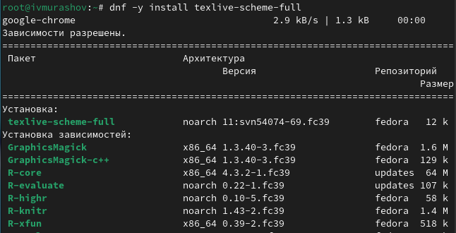{#fig:027 width=70%}

## Выполнение заданий для домашней работы

Получаю информацию о версии ядра Linux (рис. [-@fig:028]).

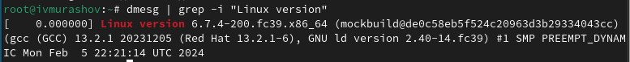{#fig:028 width=70%}

Получаю информацию о частоте процессора (рис. [-@fig:029]).

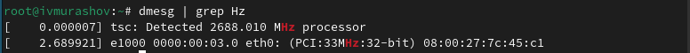{#fig:029 width=70%}

Получаю информацию о модели процессора (рис. [-@fig:030]).

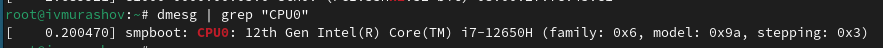{#fig:030 width=70%}

Получаю информацию об объёме доступной оперативной памяти в мегабайтах (free)(рис. [-@fig:031]).

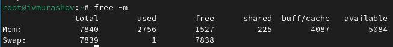{#fig:031 width=70%}

Получаю информацию о типе обнаруженного гипервизора (рис. [-@fig:032).

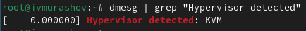{#fig:032 width=70%}

Получаю информацию о типе файловой системы корневого раздела (рис. [-@fig:033]).

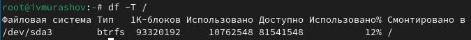{#fig:033 width=70%}

Получаю информацию о последовательности монтирования файловых систем (рис. [-@fig:034]).

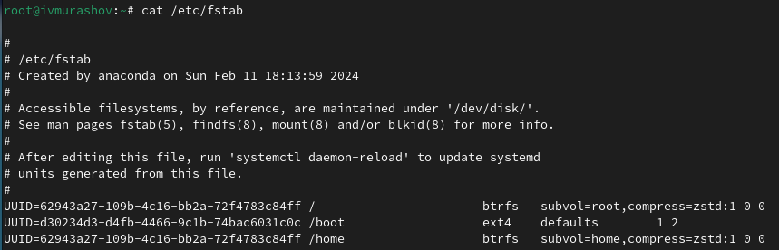{#fig:034 width=70%}

## Ответы на контрольные вопросы

1. Какую информацию содержит учётная запись пользователя?

Учётная запись содержит данные, необходимые для идентификации пользователя в системе.

2. Укажите команды терминала и приведите примеры:

--help - для получения справки по команде;
cd - для перемещения по файловой системе;
ls - для просмотра содержимого каталога;
du - для определения объёма каталога;
mkdir / rmdir - для создания / удаления каталогов;
touch / rm - для создания / удаления файлов;
chmod - для задания определённых прав на файл / каталог;
history - для просмотра истории команд.

3. Что такое файловая система? Приведите примеры с краткой характеристикой.

Файловая система - это порядок, определяющий способ организации, хранения и именования данных на различных носителях информации.

Примеры:

FAT32 (File Allocation Table)- файловая система, одной из особенностей которой является возможность применения не только на современных моделях компьютеров, но и в устаревших устройствах и консолях, снабженных разъемом USB. Логически разделена на 3 сопредельные области: зарезервированный сектор для служебных структур, табличная форма указателей, непосредственная зона записи содержимого файлов.

ReFS (Resilient File System). Файловая система ReFS обладает высокой отказоустойчивостью благодаря реализации новых функций: Copy-on-Write (CoW) – никакие метаданные не изменяются без копирования; данные записываются на новое дисковое пространство, а не поверх существующих файлов; при модификации метаданных новая копия хранится в свободном дисковом пространстве, затем система создает ссылку из старых метаданных на новую версию.

4. Как посмотреть, какие файловые системы подмонтированы в ОС?

Для того, чтобы посмотреть, какие файловые системы подмонтированы в ОС, следует ввести команду 'df'.

5. Как удалить зависший процесс?

Для удаления зависшего процесса следует узнать его id с помощью команды 'ps', затем ввести команду 'kill < id процесса >'. Альтернативным способом является использование команды 'killall', но она удалит все текущие процессы.

# Выводы

При выполнении данной лабораторной работы я приобрёл практические навыки установки операционной системы на виртуальную машину и настройки минимально необходимых для дальнейшей работы сервисов.

# Список литературы{.unnumbered}

::: {#refs}
1. Dash, P. Getting Started with Oracle VM VirtualBox / P. Dash. – Packt Publishing Ltd, 2013. – 86 сс.

2. Colvin, H. VirtualBox: An Ultimate Guide Book on Virtualization with VirtualBox. VirtualBox / H. Colvin. – CreateSpace Independent Publishing Platform, 2015. – 70 сс.

3. Vugt, S. van. Red Hat RHCSA/RHCE 7 cert guide : Red Hat Enterprise Linux 7 (EX200 and EX300) : Certification Guide. Red Hat RHCSA/RHCE 7 cert guide / S. van Vugt. – Pearson IT Certification, 2016. – 1008 сс.

4. Робачевский, А. Операционная система UNIX / А. Робачевский, С. Немнюгин, О. Стесик. – 2-е изд. – Санкт-Петербург : БХВ-Петербург, 2010. – 656 сс.

5. Немет, Э. Unix и Linux: руководство системного администратора. Unix и Linux / Э. Немет, Г. Снайдер, Т.Р. Хейн, Б. Уэйли. – 4-е изд. – Вильямс, 2014. – 1312 сс.

6. Колисниченко, Д.Н. Самоучитель системного администратора Linux : Системный администратор / Д.Н. Колисниченко. – Санкт-Петербург : БХВ-Петербург, 2011. – 544 сс.

7. Robbins, A. Bash Pocket Reference / A. Robbins. – O’Reilly Media, 2016. – 156 сс.
:::
