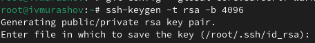
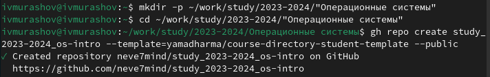

---
## Front matter
lang: ru-RU
title: Лабораторная работа №2
subtitle: Операционные системы
author:
  - Мурашов И. В., НКАбд-04-23
institute:
  - Российский университет дружбы народов, Москва, Россия
  
date: 25 февраля 2024

## i18n babel
babel-lang: russian
babel-otherlangs: english

## Formatting pdf
toc: false
toc-title: Содержание
slide_level: 2
aspectratio: 169
section-titles: true
theme: metropolis
header-includes:
 - \metroset{progressbar=frametitle,sectionpage=progressbar,numbering=fraction}
 - '\makeatletter'
 - '\beamer@ignorenonframefalse'
 - '\makeatother'
 
## Fonts
mainfont: PT Serif
romanfont: PT Serif
sansfont: PT Sans
monofont: PT Mono
mainfontoptions: Ligatures=TeX
romanfontoptions: Ligatures=TeX
sansfontoptions: Ligatures=TeX,Scale=MatchLowercase
monofontoptions: Scale=MatchLowercase,Scale=0.9
---

## Докладчик

:::::::::::::: {.columns align=center}
::: {.column width="70%"}

  * Мурашов Иван Вячеславович
  * Cтудент, 1 курс, группа НКАбд-04-23
  * Российский университет дружбы народов
  * [1132236018@rudn.ru](mailto:1132236018@rudn.ru)
  * <https://github.com/neve7mind>

:::
::: {.column width="30%"}

:::
::::::::::::::

## Цель работы

Целью данной лабораторной работы является изучение идеологии, применение средств контроля версий и освоение умений по работе с git. 

## Выполнение лабораторной работы

Для начала я устанавливаю git.

## Выполнение лабораторной работы

Затем устанавливаю gh.

## Выполнение лабораторной работы

Задаю имя и email владельца репозитория.

## Выполнение лабораторной работы

Настравиваю utf-8 в выводе сообщений git и задаю имя начальной ветки.

## Выполнение лабораторной работы

Настраиваю параметры autocrlf и safecrlf.

## Выполнение лабораторной работы

Создаю ключ SSH по алгоритму rsa с ключом размером 4096 бит.

## Выполнение лабораторной работы

А затем по алгоритму ed25519.

## Выполнение лабораторной работы

Генерирую ключ PGP, выбирая из предложенных опций тип 'RSA and RSA', размер 4096, без срока действия. Указываю имя и адрес email.

## Выполнение лабораторной работы

У меня уже был создан профиль на github.

## Выполнение лабораторной работы

Вывожу список ключей.

## Выполнение лабораторной работы

Копирую сгенерированный pgp ключ в буфер обмена.

## Выполнение лабораторной работы

Перехожу в настройки GitHub, нажимаю на кнопку 'New GPG key' и вставляю скопированный ключ в поле ввода.

## Выполнение лабораторной работы

Используя введёный email, указываю Git применять его при подписи коммитов.

## Выполнение лабораторной работы

Авторизуюсь с помощью браузера (gh login).

## Выполнение лабораторной работы

Создаю каталог курса, перемещаюсь в него и создаю репозиторий на основе шаблона.

## Выполнение лабораторной работы

Клонирую репозиторий.

## Выполнение лабораторной работы

Удаляю лишние файлы, создаю необходимые каталоги.

## Выполнение лабораторной работы

Отправляю файлы на сервер.

## Выводы

В ходе выполнения данной лабораторной работы я изучил идеологии и применение средств контроля версий и освоил умения по работе с git.
