---
## Front matter
title: "Отчёт по лабораторной работе №2"
subtitle: "Операционные системы"
author: "Мурашов Иван Вячеславович"

## Generic otions
lang: ru-RU
toc-title: "Содержание"

## Bibliography
bibliography: bib/cite.bib
csl: pandoc/csl/gost-r-7-0-5-2008-numeric.csl

## Pdf output format
toc: true # Table of contents
toc-depth: 2
lof: true # List of figures
lot: true # List of tables
fontsize: 12pt
linestretch: 1.5
papersize: a4
documentclass: scrreprt
## I18n polyglossia
polyglossia-lang:
  name: russian
  options:
	- spelling=modern
	- babelshorthands=true
polyglossia-otherlangs:
  name: english
## I18n babel
babel-lang: russian
babel-otherlangs: english
## Fonts
mainfont: PT Serif
romanfont: PT Serif
sansfont: PT Sans
monofont: PT Mono
mainfontoptions: Ligatures=TeX
romanfontoptions: Ligatures=TeX
sansfontoptions: Ligatures=TeX,Scale=MatchLowercase
monofontoptions: Scale=MatchLowercase,Scale=0.9
## Biblatex
biblatex: true
biblio-style: "gost-numeric"
biblatexoptions:
  - parentracker=true
  - backend=biber
  - hyperref=auto
  - language=auto
  - autolang=other*
  - citestyle=gost-numeric
## Pandoc-crossref LaTeX customization
figureTitle: "Рис."
tableTitle: "Таблица"
listingTitle: "Листинг"
lofTitle: "Список иллюстраций"
lotTitle: "Список таблиц"
lolTitle: "Листинги"
## Misc options
indent: true
header-includes:
  - \usepackage{indentfirst}
  - \usepackage{float} # keep figures where there are in the text
  - \floatplacement{figure}{H} # keep figures where there are in the text
---

# Цель работы

Целью данной лабораторной работы является изучение идеологии, применение средств контроля версий и освоение умений по работе с git. 

# Задание

1. Установить программное обеспечение

2. Создать базовую конфигурацию для работы с git

3. Создать ключ SSH

4. Создать ключ PGP

5. Создать профиль на GitHub и авторизоваться на устройстве

6. Создать репозиторий курса на основе шаблона

7. Настроить каталог курса

# Теоретическое введение
Целью данной лабораторной работы является изучение идеологии, применение средств контроля версий и освоение умений по работе с git. 
Системы контроля версий (Version Control System, VCS) применяются при работе нескольких человек над одним проектом. Обычно основное дерево проекта хранится в локальном или удалённом репозитории, к которому настроен доступ для участников проекта. При внесении изменений в содержание проекта система контроля версий позволяет их фиксировать, совмещать изменения, произведённые разными участниками проекта, производить откат к любой более ранней версии проекта, если это требуется.

Среди классических VCS наиболее известны CVS, Subversion, а среди распределённых — Git, Bazaar, Mercurial. Принципы их работы схожи, отличаются они в основном синтаксисом используемых в работе команд.

# Выполнение лабораторной работы

## Установка программного обеспечения

Для начала я устанавливаю git (рис. [-@fig:001]).

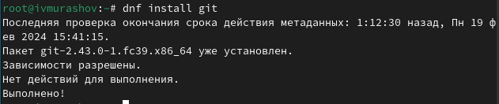{#fig:001 width=70%}

Затем устанавливаю gh (рис. [-@fig:002]).

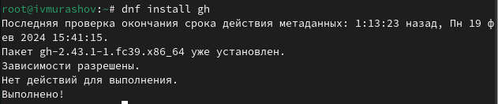{#fig:002 width=70%}

## Базовая настройка git 

Задаю имя и email владельца репозитория (рис. [-@fig:003]).

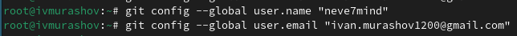{#fig:003 width=70%}

Настравиваю utf-8 в выводе сообщений git и задаю имя начальной ветки (рис. [-@fig:004]).

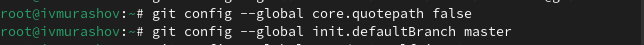{#fig:004 width=70%}

Настраиваю параметры autocrlf и safecrlf (рис. [-@fig:005]).

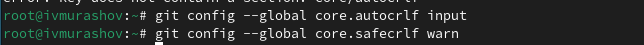{#fig:005 width=70%}

## Создание ключей

Создаю ключ SSH по алгоритму rsa с ключом размером 4096 бит (рис. [-@fig:006]).

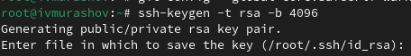{#fig:006 width=70%}

А затем по алгоритму ed25519 (рис. [-@fig:007]).

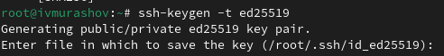{#fig:007 width=70%}

Генерирую ключ PGP, выбирая из предложенных опций тип 'RSA and RSA', размер 4096, без срока действия. Указываю имя и адрес email (рис. [-@fig:008]).

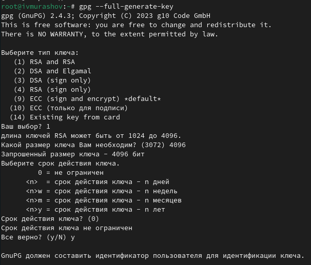{#fig:008 width=70%}

## Настройка github и добавление ключей

У меня уже был создан профиль на github (рис. [-@fig:009]).

{#fig:009 width=70%}

Вывожу список ключей (рис. [-@fig:010]).

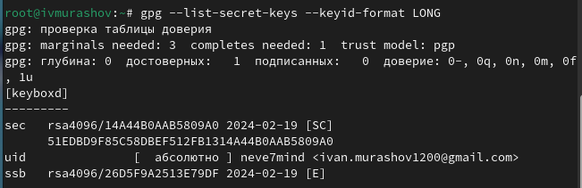{#fig:010 width=70%}

Копирую сгенерированный pgp ключ в буфер обмена (рис. [-@fig:011]).

{#fig:011 width=70%}

Перехожу в настройки GitHub, нажимаю на кнопку 'New GPG key' и вставляю скопированный ключ в поле ввода (рис. [-@fig:012]).

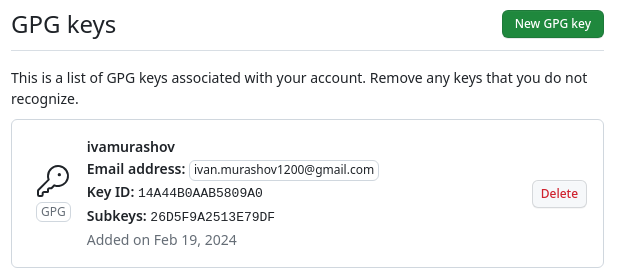{#fig:012 width=70%}

## Настройка автоматических подписей коммитов git и авторизация

Используя введёный email, указываю Git применять его при подписи коммитов (рис. [-@fig:013]).

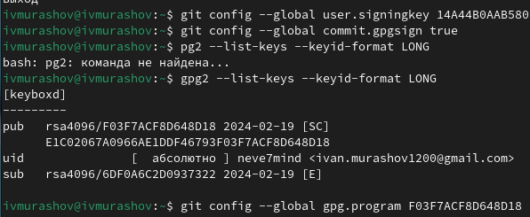{#fig:013 width=70%}

Авторизуюсь с помощью браузера (gh login) (рис. [-@fig:014]).

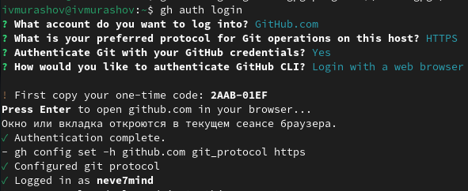{#fig:014 width=70%}

## Создание репозитория курса на основе шаблона и настройка каталога

Создаю каталог курса, перемещаюсь в него и создаю репозиторий на основе шаблона (рис. [-@fig:015]).

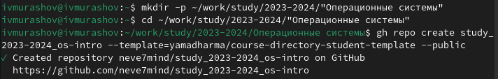{#fig:015 width=70%}

Клонирую репозиторий (рис. [-@fig:016]).

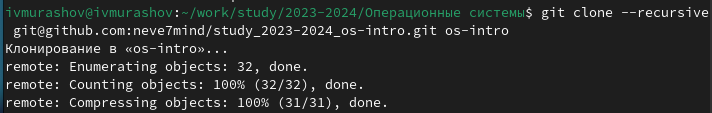{#fig:016 width=70%}

Удаляю лишние файлы, создаю необходимые каталоги (рис. [-@fig:017]).

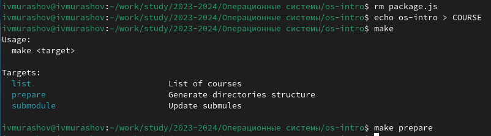{#fig:017 width=70%}

Отправляю файлы на сервер (рис. [-@fig:018]).

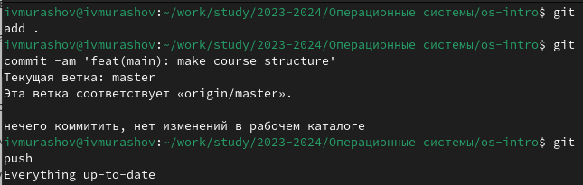{#fig:018 width=70%}

# Ответы на контрольные вопросы

1. Что такое системы контроля версий (VCS) и для решения каких задач они предназначаются?

Системы контроля версий (Version Control System, VCS) применяются при работе нескольких человек над одним проектом. Обычно основное дерево проекта хранится в локальном или удалённом репозитории, к которому настроен доступ для участников проекта. При внесении изменений в содержание проекта система контроля версий позволяет их фиксировать, совмещать изменения, произведённые разными участниками проекта, производить откат к любой более ранней версии проекта, если это требуется.

2. Объясните следующие понятия VCS и их отношения: хранилище, commit, история, рабочая копия.

Хранилище - это репозиторий, в котором хрянятся все документы, включая историю изменений.

Commit - отслеживание и сохранение изменений.

История - сохраняет в себе изменения проекта на всех его этапах.

Рабочая копия - копия проекта на основе версии из хранилища.

3. Что представляют собой и чем отличаются централизованные и децентрализованные VCS? Приведите примеры VCS каждого вида.

Централизованные VCS (CVS, SVN, TFS) - одно главное хранилище всего проекта, каждый участник проекта добавляет изменения в данное хранилище.

Децентрализованные VCS (Git, Bazaar) - у каждого участника свой вариант репозитория, что позволяет соединять впоследствии нужные ветки проекта.

4. Опишите действия с VCS при единоличной работе с хранилищем.

Создаётся и подключается удалённый репозиторий. Участник проекта при взаимодействии с данным репозиторием отправляет все изменения на сервер.

5. Опишите порядок работы с общим хранилищем VCS.

Участник получает определённую версию проекта в хранилище. Участник отправляет все изменения на сервер. При этом старые версии проекта сохраняются.

6. Каковы основные задачи, решаемые инструментальным средством git?

Хранение информации об изменениях проекта, возможность совместной работы над одним проектом.

7. Назовите и дайте краткую характеристику командам git.

Создание основного дерева репозитория: git init

Получение обновлений (изменений) текущего дерева из центрального репозитория: git pull

Отправка всех произведённых изменений локального дерева в центральный репозиторий: git push

Просмотр списка изменённых файлов в текущей директории: git status

Просмотр текущих изменений: git diff

Сохранение текущих изменений:
    добавить все изменённые и/или созданные файлы и/или каталоги: git add .
    
    добавить конкретные изменённые и/или созданные файлы и/или каталоги: git add <имена_файлов>
    
    удалить файл и/или каталог из индекса репозитория (при этом файл и/или каталог остаётся в локальной директории): git rm <имена_файлов>
    
Сохранение добавленных изменений:
    
    сохранить все добавленные изменения и все изменённые файлы: git commit -am 'Описание коммита'
    
    сохранить добавленные изменения с внесением комментария через встроенный редактор: git commit

    создание новой ветки, базирующейся на текущей: git checkout -b имя_ветки
    
    переключение на некоторую ветку: git checkout имя_ветки

    отправка изменений конкретной ветки в центральный репозиторий: git push origin имя_ветки

    слияние ветки с текущим деревом: git merge --no-ff имя_ветки
    
Удаление ветки:

    удаление локальной уже слитой с основным деревом ветки: git branch -d имя_ветки
    
    принудительное удаление локальной ветки: git branch -D имя_ветки
    
    удаление ветки с центрального репозитория: git push origin :имя_ветки
    
8. Приведите примеры использования при работе с локальным и удалённым репозиториями.

git commit -am 'feat(main): make course structure' - сохранение всех добавленных изменений и всех изменённых файлов

9. Что такое и зачем могут быть нужны ветви (branches)?

Ветви - это варианты развития проекта в хранилище. Они нужны для удобства коллективной работы с хранилищем, а так же для создания "пробных" версий проекта

10. Как и зачем можно игнорировать некоторые файлы при commit?

Во время работы над проектом так или иначе могут создаваться файлы, которые не требуется добавлять в последствии в репозиторий. Например, временные файлы, создаваемые редакторами, или объектные файлы, создаваемые компиляторами. Можно прописать шаблоны игнорируемых при добавлении в репозиторий типов файлов в файл .gitignore с помощью сервисов. Для этого сначала нужно получить список имеющихся шаблонов:

curl -L -s https://www.gitignore.io/api/list

Затем скачать шаблон, например, для C и C++

curl -L -s https://www.gitignore.io/api/c >> .gitignore
curl -L -s https://www.gitignore.io/api/c++ >> .gitignore

# Выводы

В ходе выполнения данной лабораторной работы я изучил идеологии и применение средств контроля версий и освоил умения по работе с git.
