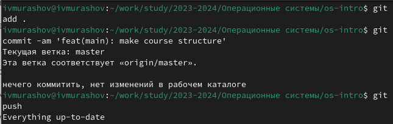

---
## Front matter
lang: ru-RU
title: Лабораторная работа №3
subtitle: Операционные системы
author:
  - Мурашов И. В., НКАбд-04-23
institute:
  - Российский университет дружбы народов, Москва, Россия
  
date: 29 февраля 2024

## i18n babel
babel-lang: russian
babel-otherlangs: english

## Formatting pdf
toc: false
toc-title: Содержание
slide_level: 2
aspectratio: 169
section-titles: true
theme: metropolis
header-includes:
 - \metroset{progressbar=frametitle,sectionpage=progressbar,numbering=fraction}
 - '\makeatletter'
 - '\beamer@ignorenonframefalse'
 - '\makeatother'
 
## Fonts
mainfont: PT Serif
romanfont: PT Serif
sansfont: PT Sans
monofont: PT Mono
mainfontoptions: Ligatures=TeX
romanfontoptions: Ligatures=TeX
sansfontoptions: Ligatures=TeX,Scale=MatchLowercase
monofontoptions: Scale=MatchLowercase,Scale=0.9
---

## Докладчик

:::::::::::::: {.columns align=center}
::: {.column width="70%"}

  * Мурашов Иван Вячеславович
  * Cтудент, 1 курс, группа НКАбд-04-23
  * Российский университет дружбы народов
  * [1132236018@rudn.ru](mailto:1132236018@rudn.ru)
  * <https://github.com/neve7mind>

:::
::: {.column width="30%"}

:::
::::::::::::::

## Цель работы

Целью данной лабораторной работы является приобретение навыков по оформлению отчётов с помощью легковесного языка разметки Markdown.

## Выполнение лабораторной работы

Я создал файл отчёта для Лабораторной работы №2 в формате Markdown.

## Выполнение лабораторной работы

Затем изменил шаблон в шапке файла.

## Выполнение лабораторной работы

Заполнил отчёт по Лабораторной работе №2.

## Выполнение лабораторной работы

По окончании форматирования отчёта я выполнил компиляцию файлов из формата md в docx и pdf с помощью Makefile. Поскольку я уже делал отчёт ранее, то сейчас никакие изменения не требуются (это отражено на скриншоте).

{#fig:004 width=70%}

## Выполнение лабораторной работы

Затем я отправил созданные файлы на глобальный репозиторий.

## Выводы

В ходе данной лабораторной работы я приобрёл навыки по оформлению отчётов с помощью легковесного языка разметки Markdown.
