---
## Front matter
lang: ru-RU
title: Лабораторная работа №4
subtitle: Операционные системы
author:
  - Мурашов И. В., НКАбд-04-23
institute:
  - Российский университет дружбы народов, Москва, Россия
  
date: 29 февраля 2024

## i18n babel
babel-lang: russian
babel-otherlangs: english

## Formatting pdf
toc: false
toc-title: Содержание
slide_level: 2
aspectratio: 169
section-titles: true
theme: metropolis
header-includes:
 - \metroset{progressbar=frametitle,sectionpage=progressbar,numbering=fraction}
 - '\makeatletter'
 - '\beamer@ignorenonframefalse'
 - '\makeatother'
 
## Fonts
mainfont: PT Serif
romanfont: PT Serif
sansfont: PT Sans
monofont: PT Mono
mainfontoptions: Ligatures=TeX
romanfontoptions: Ligatures=TeX
sansfontoptions: Ligatures=TeX,Scale=MatchLowercase
monofontoptions: Scale=MatchLowercase,Scale=0.9
---

## Докладчик

:::::::::::::: {.columns align=center}
::: {.column width="70%"}

  * Мурашов Иван Вячеславович
  * Cтудент, 1 курс, группа НКАбд-04-23
  * Российский университет дружбы народов
  * Факультет физико-математических и естественных наук
  * [1132236018@rudn.ru](mailto:1132236018@rudn.ru)
  * <https://neve7mind.github.io>

:::
::: {.column width="30%"}

:::
::::::::::::::

## Цель работы

Целью данной лабораторной работы является получение навыков правильной работы с репозиториями git.

## Выполнение лабораторной работы

Устанавливаю git-flow.

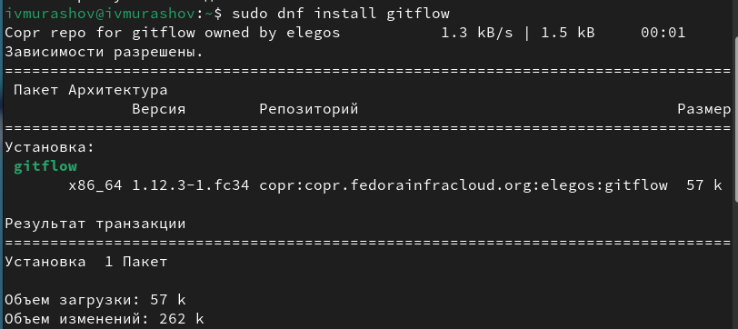

## Выполнение лабораторной работы

Устанавливаю Node.js.

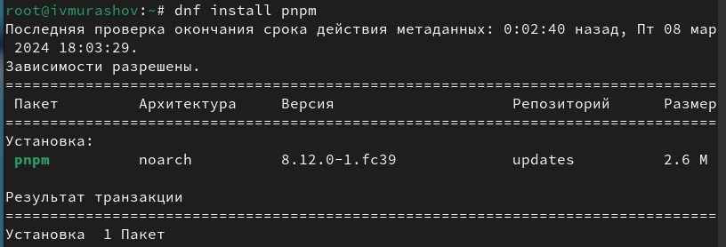

## Выполнение лабораторной работы

Настраиваю Node.js.

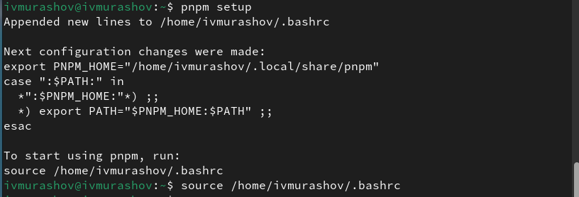

## Выполнение лабораторной работы

Устанавливаю программу для помощи в форматировании коммитов.

## Выполнение лабораторной работы

Устанавливаю программу для помощи в создании логов.

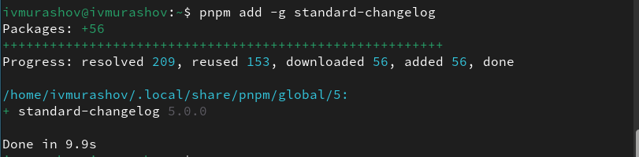

## Выполнение лабораторной работы

Создаю и клонирую репозиторий.

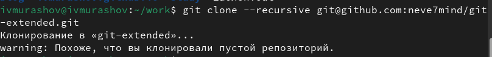

## Выполнение лабораторной работы

Настраиваю репозиторий, делаю 1ый коммит и выкладываю его на github.

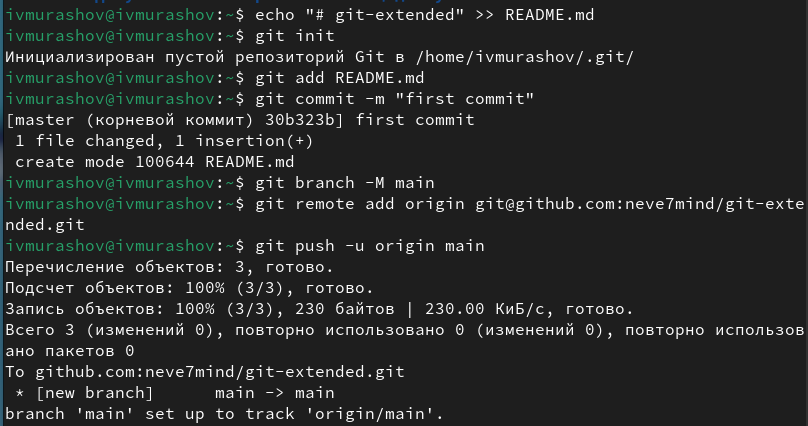

## Выполнение лабораторной работы

Настраиваю конфигурацию для для пакетов Node.js.

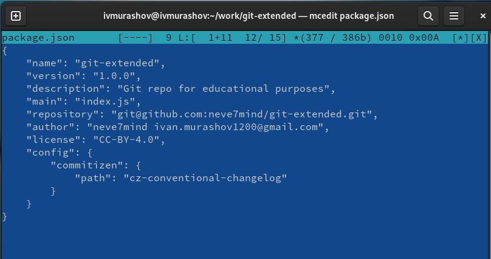

## Выполнение лабораторной работы

Добавляю новые файлы, выполняю коммит и отправляю файлы на сервер.

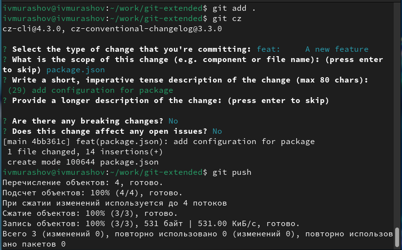

## Выполнение лабораторной работы

Инициализирую git-flow.

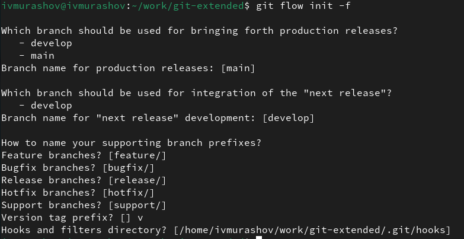

## Выполнение лабораторной работы

Проверяю, что я на ветке develop, загружаю весь репозиторий в хранилище.

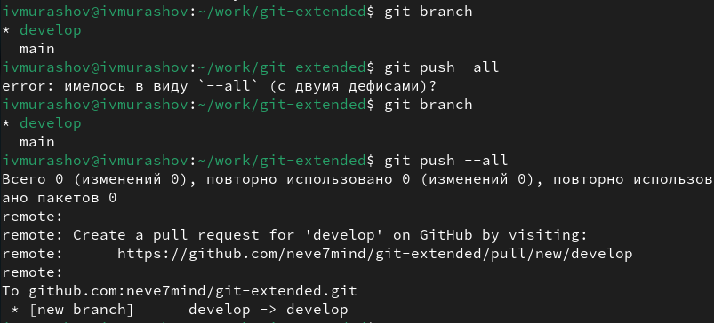

## Выполнение лабораторной работы

Устанавливаю внешнюю ветку как вышестоящую для этой ветки.

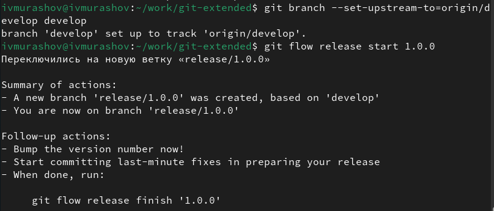

## Выполнение лабораторной работы

Создадаю релиз с версией 1.0.0, журнал изменений, добавляю журнал изменений в индекс и заливаю релизную ветку в основную.

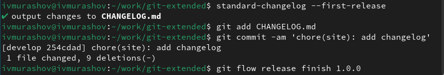

## Выполнение лабораторной работы

Отправляю данные на github.

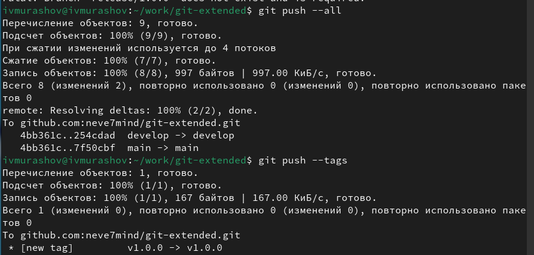

## Выполнение лабораторной работы

Создадаю релиз на github.

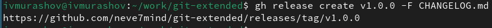

## Выполнение лабораторной работы

Создадаю ветку для новой функциональности и по окончании разработки новой функциональности объединяю ветку feature_branch c develop.

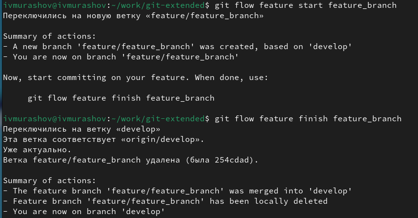

## Выполнение лабораторной работы

Создадаю релиз с версией 1.2.3.

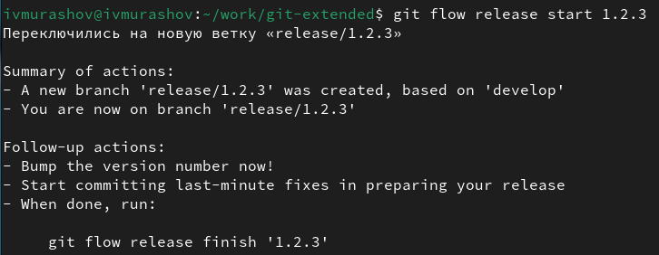

## Выполнение лабораторной работы

Обновляю номер версии в файле package.json.

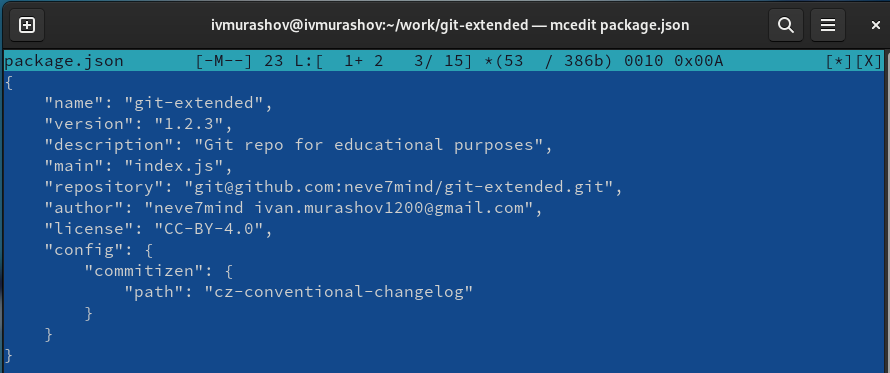

## Выполнение лабораторной работы

Заливаю релизную ветку в основную, после чего отправляю данные на github и создаю релиз на github с комментарием из журнала изменений.

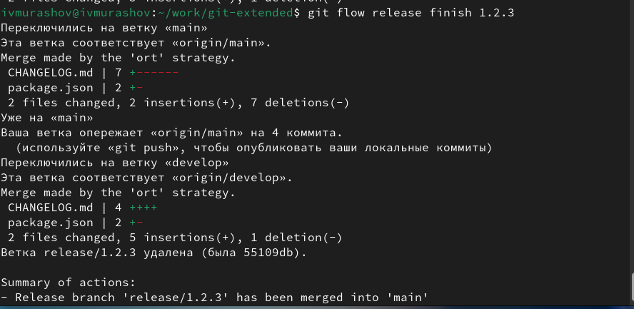

## Выводы

В ходе выполнения данной лабораторной работы я получил навыки правильной работы с репозиториями git.

