---
## Front matter
title: "Отчёт по лабораторной работе №4"
subtitle: "Операционные системы"
author: "Мурашов Иван Вячеславович"

## Generic otions
lang: ru-RU
toc-title: "Содержание"

## Bibliography
bibliography: bib/cite.bib
csl: pandoc/csl/gost-r-7-0-5-2008-numeric.csl

## Pdf output format
toc: true # Table of contents
toc-depth: 2
lof: true # List of figures
lot: true # List of tables
fontsize: 12pt
linestretch: 1.5
papersize: a4
documentclass: scrreprt
## I18n polyglossia
polyglossia-lang:
  name: russian
  options:
	- spelling=modern
	- babelshorthands=true
polyglossia-otherlangs:
  name: english
## I18n babel
babel-lang: russian
babel-otherlangs: english
## Fonts
mainfont: PT Serif
romanfont: PT Serif
sansfont: PT Sans
monofont: PT Mono
mainfontoptions: Ligatures=TeX
romanfontoptions: Ligatures=TeX
sansfontoptions: Ligatures=TeX,Scale=MatchLowercase
monofontoptions: Scale=MatchLowercase,Scale=0.9
## Biblatex
biblatex: true
biblio-style: "gost-numeric"
biblatexoptions:
  - parentracker=true
  - backend=biber
  - hyperref=auto
  - language=auto
  - autolang=other*
  - citestyle=gost-numeric
## Pandoc-crossref LaTeX customization
figureTitle: "Рис."
tableTitle: "Таблица"
listingTitle: "Листинг"
lofTitle: "Список иллюстраций"
lotTitle: "Список таблиц"
lolTitle: "Листинги"
## Misc options
indent: true
header-includes:
  - \usepackage{indentfirst}
  - \usepackage{float} # keep figures where there are in the text
  - \floatplacement{figure}{H} # keep figures where there are in the text
---

# Цель работы

Целью данной лабораторной работы является получение навыков правильной работы с репозиториями git.

# Задание

1. Выполнить работу для тестового репозитория.
2. Преобразовать рабочий репозиторий в репозиторий с git-flow и conventional commits.

# Теоретическое введение

Gitflow Workflow опубликована и популяризована Винсентом Дриссеном.

Gitflow Workflow предполагает выстраивание строгой модели ветвления с учётом выпуска проекта.

Данная модель отлично подходит для организации рабочего процесса на основе релизов.

Работа по модели Gitflow включает создание отдельной ветки для исправлений ошибок в рабочей среде.

Последовательность действий при работе по модели Gitflow:

- Из ветки master создаётся ветка develop.

- Из ветки develop создаётся ветка release.

- Из ветки develop создаются ветки feature.

- Когда работа над веткой feature завершена, она сливается с веткой develop.

- Когда работа над веткой релиза release завершена, она сливается в ветки develop и master.

- Если в master обнаружена проблема, из master создаётся ветка hotfix.

- Когда работа над веткой исправления hotfix завершена, она сливается в ветки develop и master.

# Выполнение лабораторной работы

## Установка программного обеспечения

Устанавливаю git-flow (рис. [-@fig:001]).

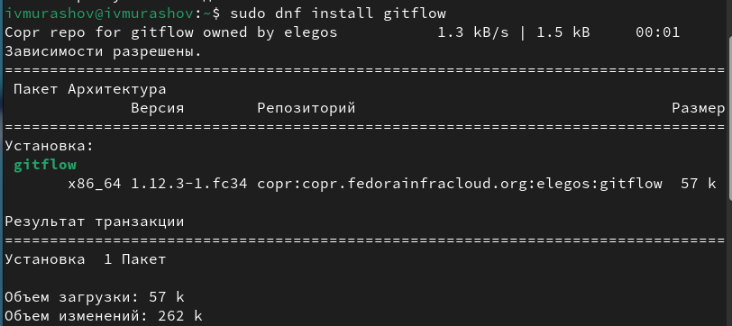{#fig:001 width=70%}

Устанавливаю Node.js (рис. [-@fig:002]).

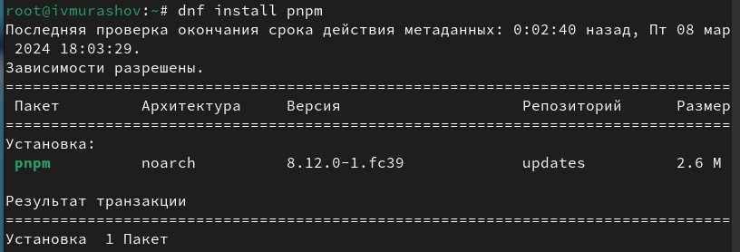{#fig:002 width=70%}

Настраиваю Node.js (рис. [-@fig:003]).

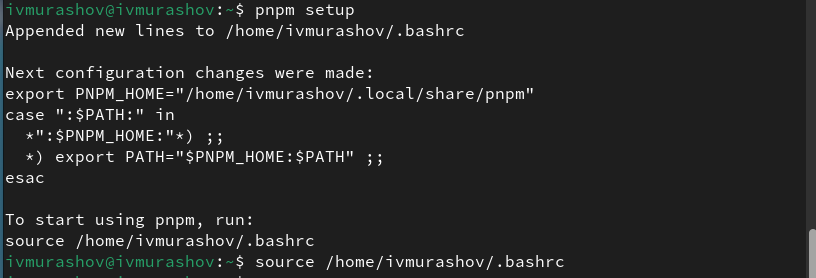{#fig:003 width=70%}

## Общепринятые коммиты

Устанавливаю программу для помощи в форматировании коммитов (рис. [-@fig:004]).

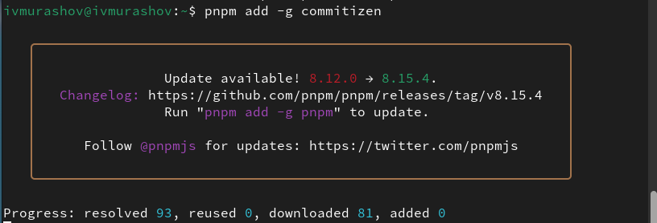{#fig:004 width=70%}

Устанавливаю программу для помощи в создании логов (рис. [-@fig:005]).

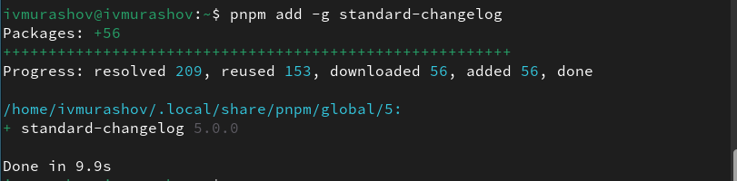{#fig:005 width=70%}

Создаю и клонирую репозиторий (рис. [-@fig:006]).

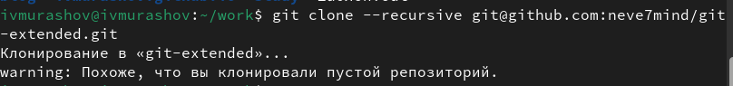{#fig:006 width=70%}

Настраиваю репозиторий, делаю 1ый коммит и выкладываю его на github (рис. [-@fig:007]).

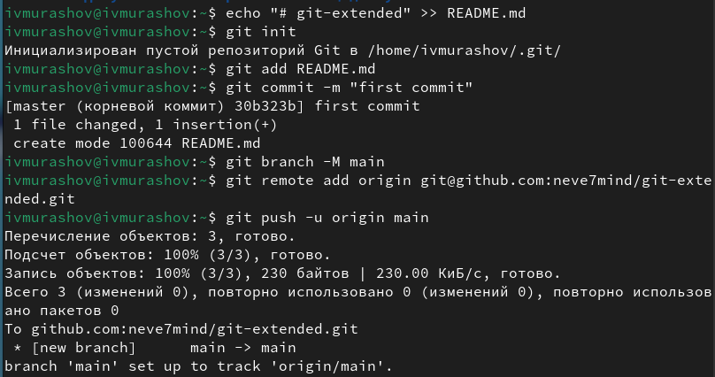{#fig:007 width=70%}

Настраиваю конфигурацию для для пакетов Node.js (рис. [-@fig:008]).

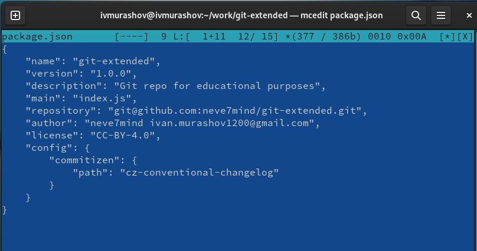{#fig:008 width=70%}

Добавляю новые файлы, выполняю коммит и отправляю файлы на сервер (рис. [-@fig:009]).

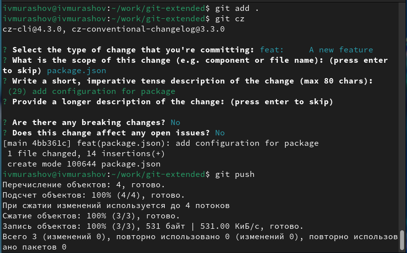{#fig:009 width=70%}

Инициализирую git-flow (рис. [-@fig:010]).

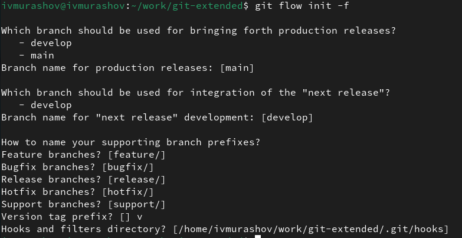{#fig:010 width=70%}

Проверяю, что я на ветке develop, загружаю весь репозиторий в хранилище (рис. [-@fig:011]).

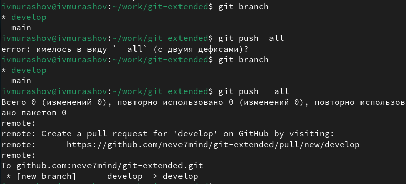{#fig:011 width=70%}

Устанавливаю внешнюю ветку как вышестоящую для этой ветки (рис. [-@fig:012]).

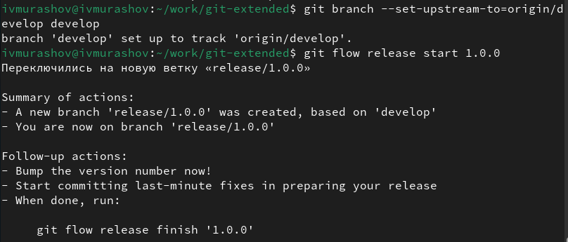{#fig:012 width=70%}

Создадаю релиз с версией 1.0.0, журнал изменений, добавляю журнал изменений в индекс и заливаю релизную ветку в основную (рис. [-@fig:013]).

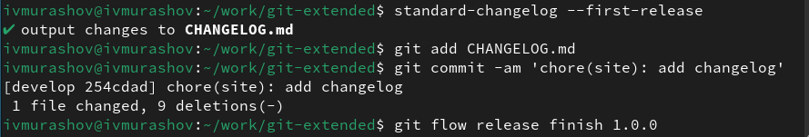{#fig:013 width=70%}

Отправляю данные на github (рис. [-@fig:014]).

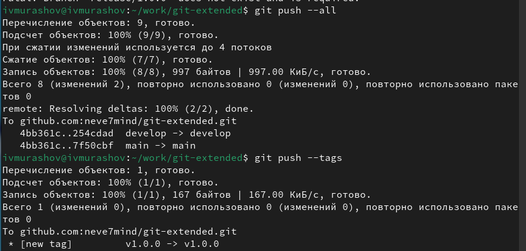{#fig:014 width=70%}

Создадаю релиз на github (рис. [-@fig:015]).

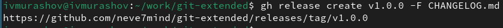{#fig:015 width=70%}

Создадаю ветку для новой функциональности и по окончании разработки новой функциональности объединяю ветку feature_branch c develop (рис. [-@fig:016]).

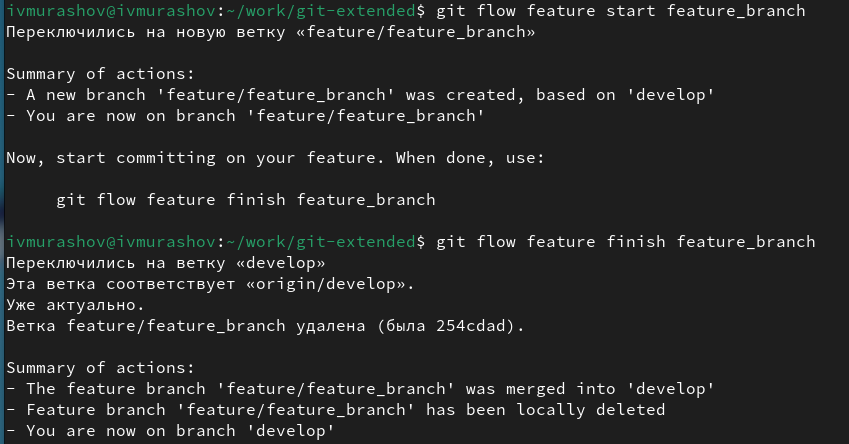{#fig:016 width=70%}

Создадаю релиз с версией 1.2.3 (рис. [-@fig:017]).

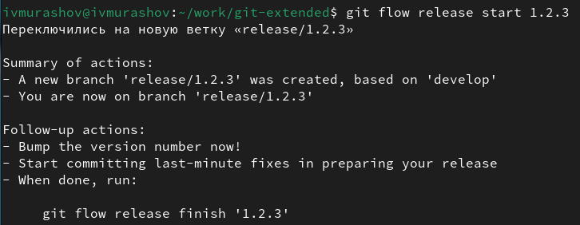{#fig:017 width=70%}

Обновляю номер версии в файле package.json (рис. [-@fig:018]).

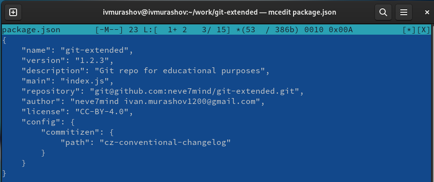{#fig:018 width=70%}

Заливаю релизную ветку в основную, после чего отправляю данные на github и создаю релиз на github с комментарием из журнала изменений (рис. [-@fig:019]).

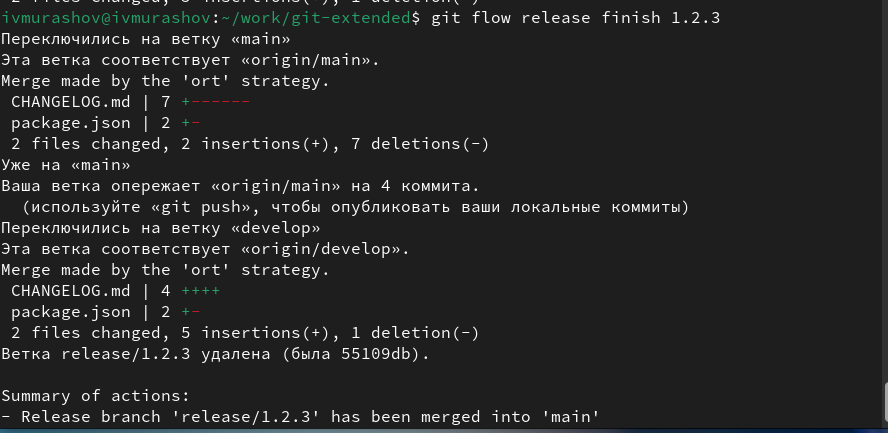{#fig:019 width=70%}

# Выводы

В ходе выполнения данной лабораторной работы я получил навыки правильной работы с репозиториями git.

