---
## Front matter
lang: ru-RU
title: Лабораторная работа №5
subtitle: Операционные системы
author:
  - Мурашов И. В., НКАбд-04-23
institute:
  - Российский университет дружбы народов, Москва, Россия
  
date: 12 марта 2024

## i18n babel
babel-lang: russian
babel-otherlangs: english

## Formatting pdf
toc: false
toc-title: Содержание
slide_level: 2
aspectratio: 169
section-titles: true
theme: metropolis
header-includes:
 - \metroset{progressbar=frametitle,sectionpage=progressbar,numbering=fraction}
 - '\makeatletter'
 - '\beamer@ignorenonframefalse'
 - '\makeatother'
 
## Fonts
mainfont: PT Serif
romanfont: PT Serif
sansfont: PT Sans
monofont: PT Mono
mainfontoptions: Ligatures=TeX
romanfontoptions: Ligatures=TeX
sansfontoptions: Ligatures=TeX,Scale=MatchLowercase
monofontoptions: Scale=MatchLowercase,Scale=0.9
---

## Докладчик

:::::::::::::: {.columns align=center}
::: {.column width="70%"}

  * Мурашов Иван Вячеславович
  * Cтудент, 1 курс, группа НКАбд-04-23
  * Российский университет дружбы народов
  * Факультет физико-математических и естественных наук
  * [1132236018@rudn.ru](mailto:1132236018@rudn.ru)
  * <https://neve7mind.github.io>

:::
::: {.column width="30%"}

:::
::::::::::::::

## Цель работы

Целью данной лабораторной работы является получение навыков настройки рабочей среды.

## Выполнение лабораторной работы

Устанавливаю pass.

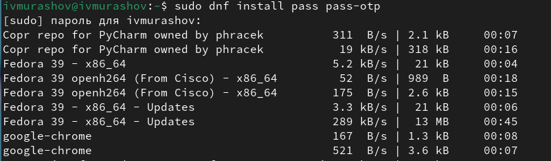

## Выполнение лабораторной работы

Устанавливаю gopass.

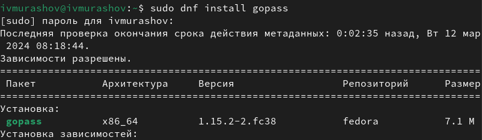

## Выполнение лабораторной работы

Создаю новый gpg ключ.

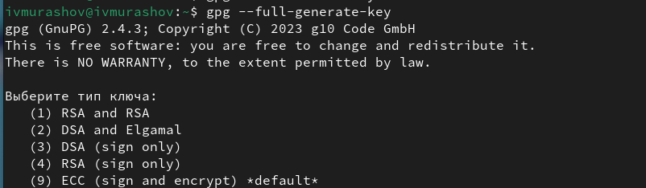

## Выполнение лабораторной работы

Просматриваю список ключей и инициализирую хранилище.

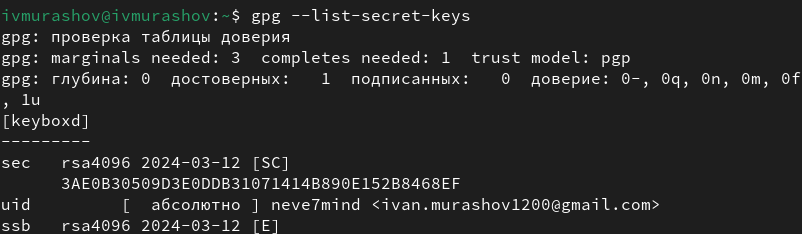

## Выполнение лабораторной работы

Создаю структуру git.

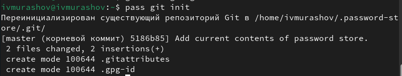

## Выполнение лабораторной работы

Задаю адрес репозитория на хостинге (репозиторий необходимо предварительно создать).

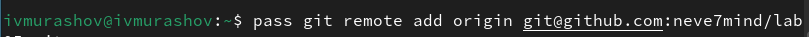

## Выполнение лабораторной работы

Для синхронизации выполняю следующие команды.

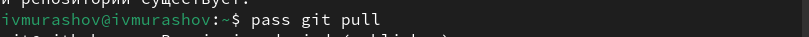

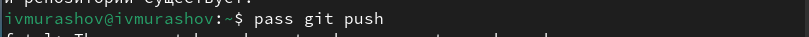

## Выполнение лабораторной работы

Вручную коммичу и выкладываю изменения.

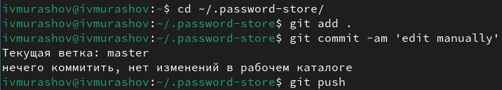

## Выполнение лабораторной работы

Проверяю статус синхронизации.

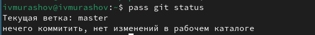

## Выполнение лабораторной работы

Устанавливаю плагин Browserpass.

## Выполнение лабораторной работы

Устанавливаю программу, обеспечивающую интерфейс native messaging.

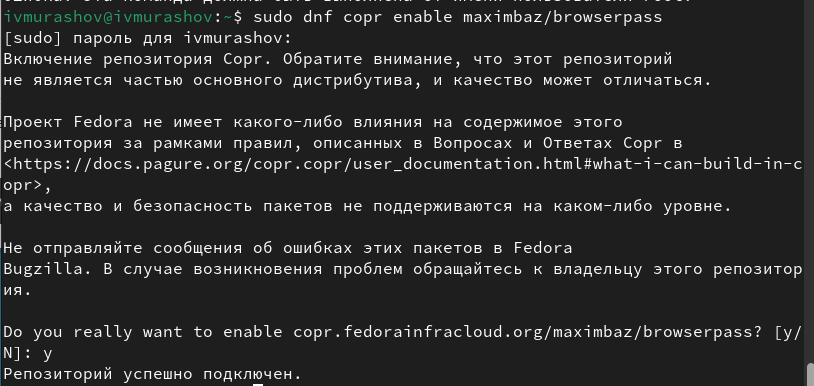

## Выполнение лабораторной работы

Выполняю команду pass insert.

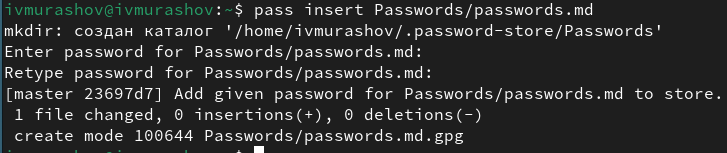

## Выполнение лабораторной работы

Заменяю существующий пароль.

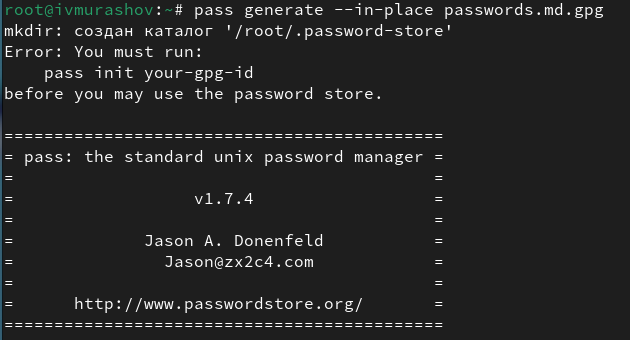

## Выполнение лабораторной работы

Устанавливаю дополнительное программное обеспечение.

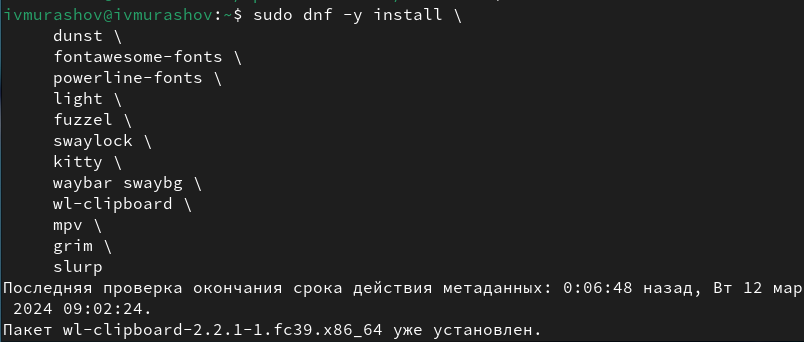

## Выполнение лабораторной работы

Устанавливаю шрифты.

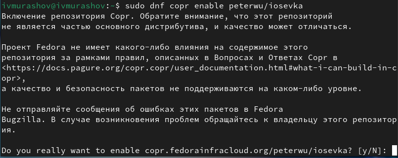

## Выполнение лабораторной работы

Устанавливаю шрифты.

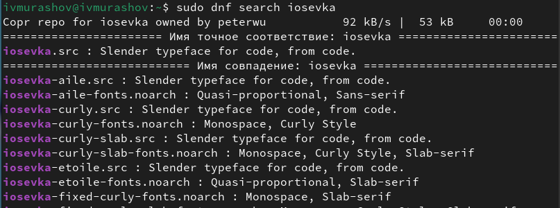

## Выполнение лабораторной работы

Устанавливаю шрифты.

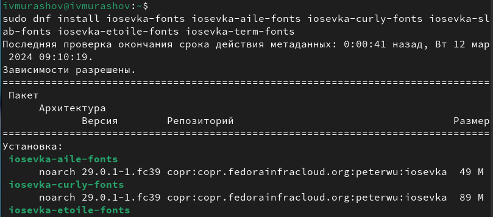

## Выполнение лабораторной работы

Устанавливаю бинарный файл со скриптом, определяющим архитектуру процессора и операционную систему и скачивающим необходимый файл.

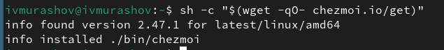

## Выполнение лабораторной работы

Создаю свой репозиторий для конфигурационных файлов на основе шаблона.

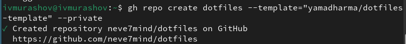

## Выполнение лабораторной работы

Инициализирую chezmoi с моим репозиторием dotfiles.

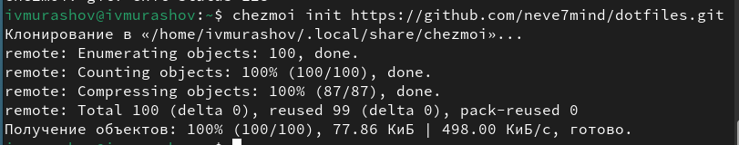

## Выполнение лабораторной работы

Проверяю, какие изменения внесёт chezmoi в домашний каталог.

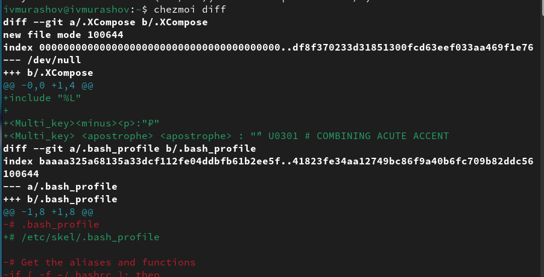

## Выполнение лабораторной работы

Вношу необходимые изменения.

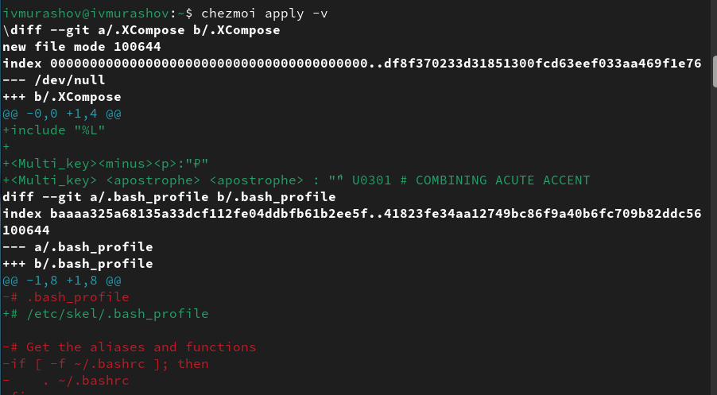

## Выполнение лабораторной работы

Извлекаю изменения из репозитория и применяю их, извлекаю последние изменения из своего репозитория и просматриваю, что изменится, фактически не применяя изменения и применяю необходимые изменения.

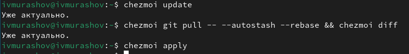

## Выполнение лабораторной работы

Подключаю автоматические фиксацию и отправку изменений в репозиторий в файле конфигурации ~/.config/chezmoi/chezmoi.toml.

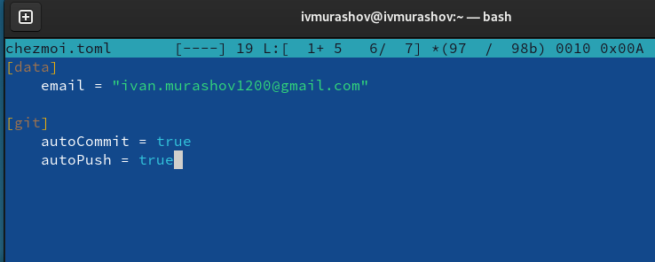

## Выводы

В ходе выполнения данной лабораторной работы я получил навыки настройки рабочей среды.
