---
## Front matter
title: "Отчёт по лабораторной работе №5"
subtitle: "Операционные системы"
author: "Мурашов Иван Вячеславович"

## Generic otions
lang: ru-RU
toc-title: "Содержание"

## Bibliography
bibliography: bib/cite.bib
csl: pandoc/csl/gost-r-7-0-5-2008-numeric.csl

## Pdf output format
toc: true # Table of contents
toc-depth: 2
lof: true # List of figures
lot: true # List of tables
fontsize: 12pt
linestretch: 1.5
papersize: a4
documentclass: scrreprt
## I18n polyglossia
polyglossia-lang:
  name: russian
  options:
	- spelling=modern
	- babelshorthands=true
polyglossia-otherlangs:
  name: english
## I18n babel
babel-lang: russian
babel-otherlangs: english
## Fonts
mainfont: PT Serif
romanfont: PT Serif
sansfont: PT Sans
monofont: PT Mono
mainfontoptions: Ligatures=TeX
romanfontoptions: Ligatures=TeX
sansfontoptions: Ligatures=TeX,Scale=MatchLowercase
monofontoptions: Scale=MatchLowercase,Scale=0.9
## Biblatex
biblatex: true
biblio-style: "gost-numeric"
biblatexoptions:
  - parentracker=true
  - backend=biber
  - hyperref=auto
  - language=auto
  - autolang=other*
  - citestyle=gost-numeric
## Pandoc-crossref LaTeX customization
figureTitle: "Рис."
tableTitle: "Таблица"
listingTitle: "Листинг"
lofTitle: "Список иллюстраций"
lotTitle: "Список таблиц"
lolTitle: "Листинги"
## Misc options
indent: true
header-includes:
  - \usepackage{indentfirst}
  - \usepackage{float} # keep figures where there are in the text
  - \floatplacement{figure}{H} # keep figures where there are in the text
---

# Цель работы

Целью данной лабораторной работы является получение навыков настройки рабочей среды.

# Задание

1. Установка и настройка менеджера паролей pass

2. Настройка интерфейса с браузером

3. Сохранение пароля

4. Управление файлами конфигурации

5. Создание и подключение собственного репозитория

# Теоретическое введение

Менеджер паролей pass — программа, сделанная в рамках идеологии Unix.

Также носит название стандартного менеджера паролей для Unix (The standard Unix password manager).

Основные свойства:

- Данные хранятся в файловой системе в виде каталогов и файлов.

- Файлы шифруются с помощью GPG-ключа.

Структура базы может быть произвольной, если Вы собираетесь использовать её напрямую, без промежуточного программного обеспечения. Тогда семантику структуры базы данных Вы держите в своей голове.

Если же необходимо использовать дополнительное программное обеспечение, необходимо семантику заложить в структуру базы паролей.

# Выполнение лабораторной работы

## Установка и настройка менеджера паролей pass

Устанавливаю pass (рис. [-@fig:001]).

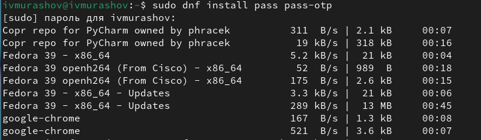{#fig:001 width=70%}

Устанавливаю gopass (рис. [-@fig:002]).

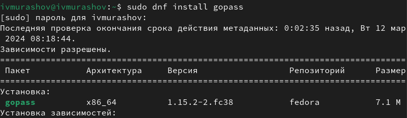{#fig:002 width=70%}

Создаю новый gpg ключ (рис. [-@fig:003]).

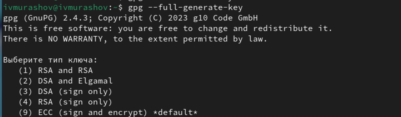{#fig:003 width=70%}

Просматриваю список ключей и инициализирую хранилище (рис. [-@fig:004]).

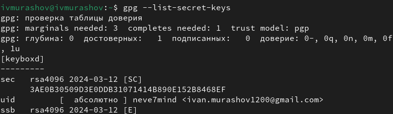{#fig:004 width=70%}

Создаю структуру git (рис. [-@fig:005]).

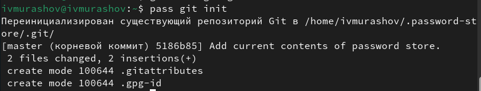{#fig:005 width=70%}

Задаю адрес репозитория на хостинге (репозиторий необходимо предварительно создать) (рис. [-@fig:006]).

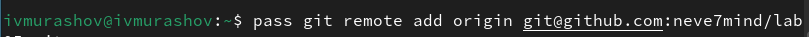{#fig:006 width=70%}

Для синхронизации выполняю следующие команды (рис. [-@fig:007]), (рис. [-@fig:008]).

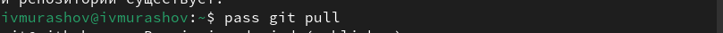{#fig:007 width=70%}

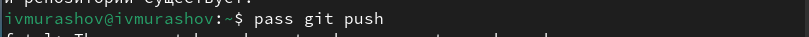{#fig:008 width=70%}

Вручную коммичу и выкладываю изменения (рис. [-@fig:009]).

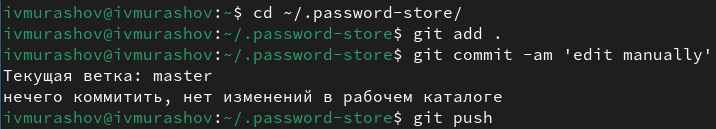{#fig:009 width=70%}

Проверяю статус синхронизации (рис. [-@fig:010]).

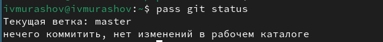{#fig:010 width=70%}

## Настройка интерфейса с браузером

Устанавливаю плагин Browserpass (рис. [-@fig:011]).

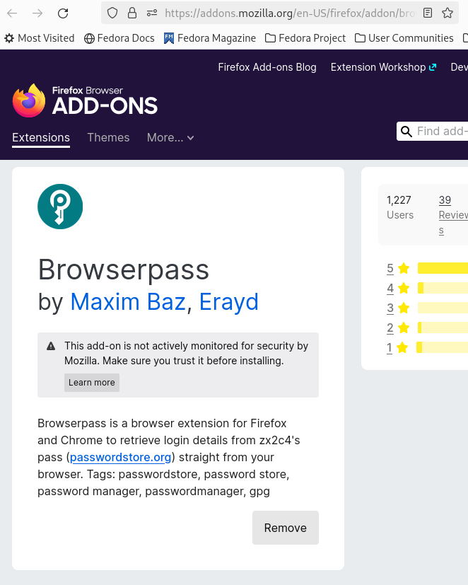{#fig:011 width=70%}

Устанавливаю программу, обеспечивающую интерфейс native messaging (рис. [-@fig:012]).

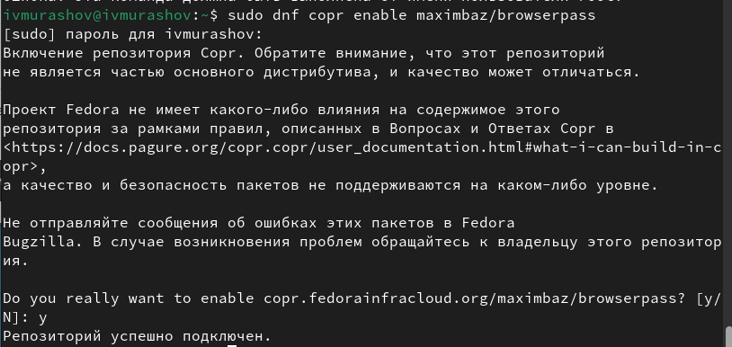{#fig:012 width=70%}

## Сохранение пароля

Выполняю команду pass insert (рис. [-@fig:013]).

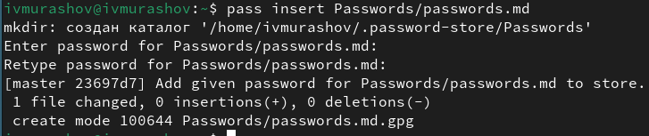{#fig:013 width=70%}

Заменяю существующий пароль (рис. [-@fig:014]).

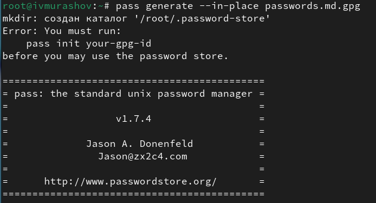{#fig:014 width=70%}

## Управление файлами конфигурации

Устанавливаю дополнительное программное обеспечение (рис. [-@fig:015]).

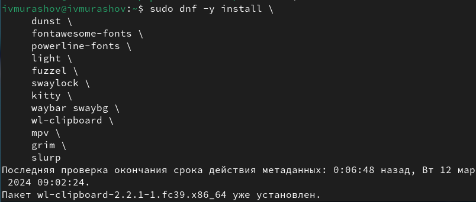{#fig:015 width=70%}

Устанавливаю шрифты (рис. [-@fig:016]).

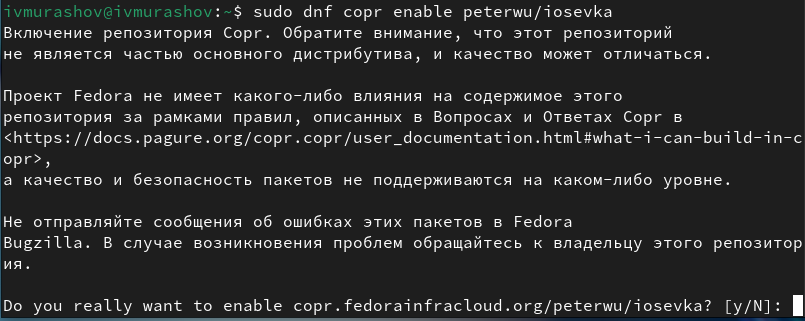{#fig:016 width=70%}

Устанавливаю шрифты (рис. [-@fig:017]).

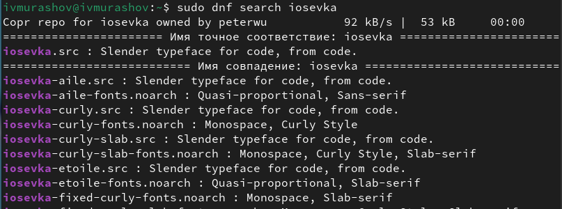{#fig:017 width=70%}

Устанавливаю шрифты (рис. [-@fig:018]).

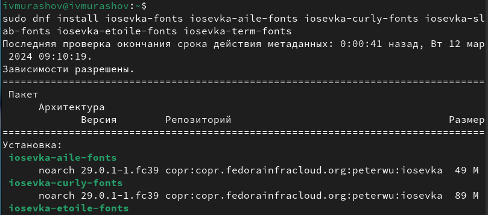{#fig:018 width=70%}

Устанавливаю бинарный файл со скриптом, определяющим архитектуру процессора и операционную систему и скачивающим необходимый файл (рис. [-@fig:019]).

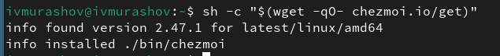{#fig:019 width=70%}

## Создание и подключение собственного репозитория

Создаю свой репозиторий для конфигурационных файлов на основе шаблона (рис. [-@fig:020]).

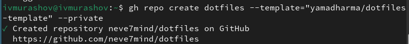{#fig:020 width=70%}

Инициализирую chezmoi с моим репозиторием dotfiles (рис. [-@fig:021]).

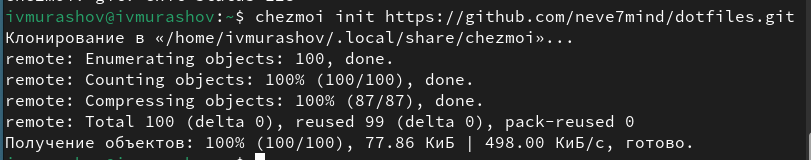{#fig:021 width=70%}

Проверяю, какие изменения внесёт chezmoi в домашний каталог (рис. [-@fig:022]).

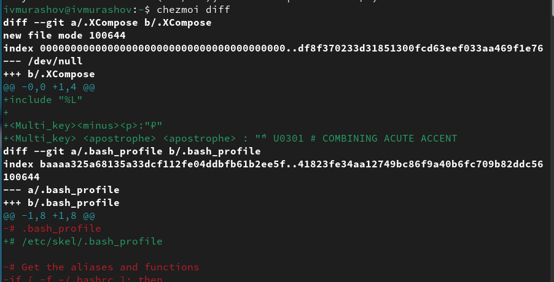{#fig:022 width=70%}

Вношу необходимые изменения (рис. [-@fig:023]).

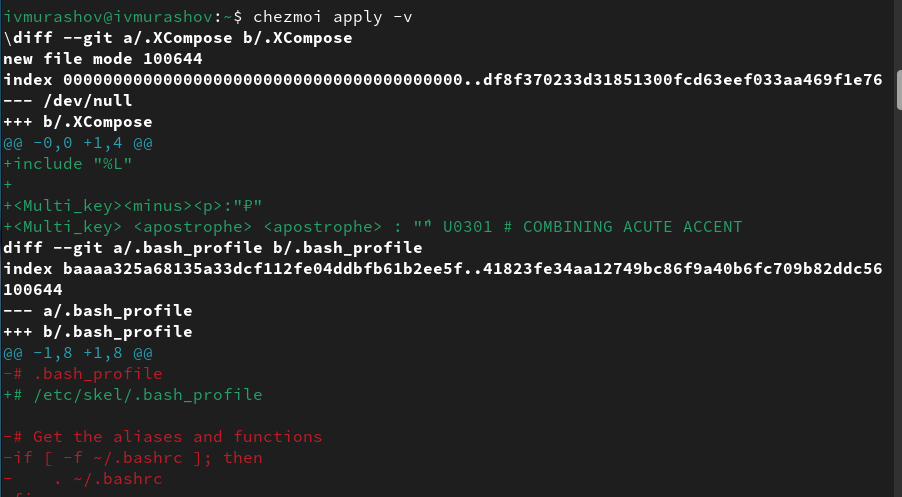{#fig:023 width=70%}

Извлекаю изменения из репозитория и применяю их, извлекаю последние изменения из своего репозитория и просматриваю, что изменится, фактически не применяя изменения и применяю необходимые изменения (рис. [-@fig:024]).

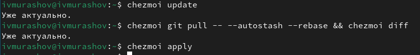{#fig:024 width=70%}

Подключаю автоматические фиксацию и отправку изменений в репозиторий в файле конфигурации ~/.config/chezmoi/chezmoi.toml (рис. [-@fig:025]).

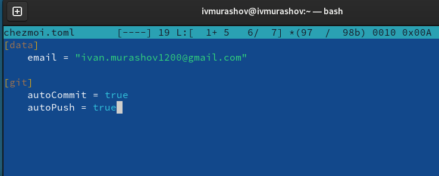{#fig:025 width=70%}

# Выводы

В ходе выполнения данной лабораторной работы я получил навыки настройки рабочей среды.

