---
## Front matter
lang: ru-RU
title: Лабораторная работа №6
subtitle: Операционные системы
author:
  - Мурашов И. В., НКАбд-04-23
institute:
  - Российский университет дружбы народов, Москва, Россия
  
date: 14 марта 2024

## i18n babel
babel-lang: russian
babel-otherlangs: english

## Formatting pdf
toc: false
toc-title: Содержание
slide_level: 2
aspectratio: 169
section-titles: true
theme: metropolis
header-includes:
 - \metroset{progressbar=frametitle,sectionpage=progressbar,numbering=fraction}
 - '\makeatletter'
 - '\beamer@ignorenonframefalse'
 - '\makeatother'
 
## Fonts
mainfont: PT Serif
romanfont: PT Serif
sansfont: PT Sans
monofont: PT Mono
mainfontoptions: Ligatures=TeX
romanfontoptions: Ligatures=TeX
sansfontoptions: Ligatures=TeX,Scale=MatchLowercase
monofontoptions: Scale=MatchLowercase,Scale=0.9
---

## Докладчик

:::::::::::::: {.columns align=center}
::: {.column width="70%"}

  * Мурашов Иван Вячеславович
  * Cтудент, 1 курс, группа НКАбд-04-23
  * Российский университет дружбы народов
  * Факультет физико-математических и естественных наук
  * [1132236018@rudn.ru](mailto:1132236018@rudn.ru)
  * <https://neve7mind.github.io>

:::
::: {.column width="30%"}

:::
::::::::::::::

## Цель работы

Целью данной лабораторной работы является приобретение практических навыков взаимодействия пользователя с системой посредством командной строки.

## Выполнение лабораторной работы

Определяю полное имя домашнего каталога.

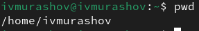

## Выполнение лабораторной работы

Вывожу на экран содержимое каталога /tmp. Для этого используйте команду ls с различными опциями. ls -a просмотреть файлы директории, включая скрытые файлы.

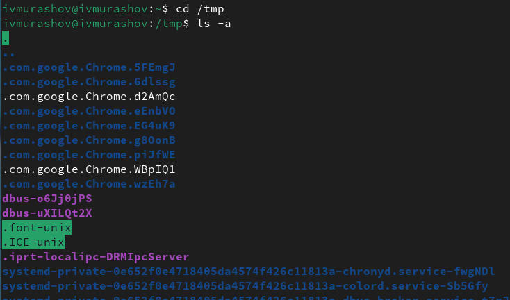

## Выполнение лабораторной работы

ls -l просмотреть подробную информацию о файлах, включая права достуа, дату и время создания.

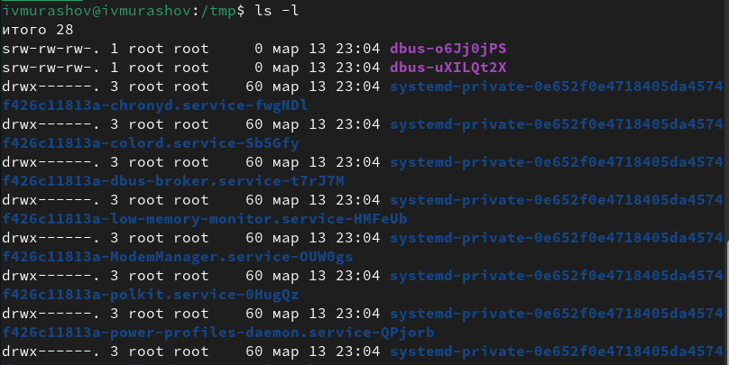

## Выполнение лабораторной работы

Определяю, есть ли в каталоге /var/spool подкаталог с именем cron.

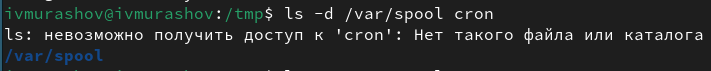

## Выполнение лабораторной работы

Перехожу в домашний каталог и вывожу на экран его содержимое, определяя, кто является владельцем файлов и подкаталогов.

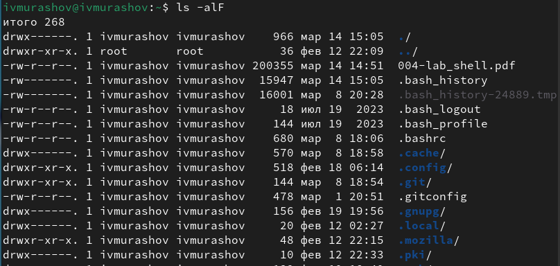

## Выполнение лабораторной работы

В домашнем каталоге создаю новый каталог с именем newdir.

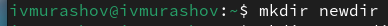

## Выполнение лабораторной работы

В каталоге ~/newdir создаю новый каталог с именем morefun.

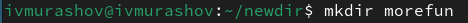

## Выполнение лабораторной работы

В домашнем каталоге создаю одной командой три новых каталога с именами letters, memos, misk. Затем удаляю эти каталоги одной командой.

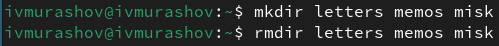

## Выполнение лабораторной работы

Удаляю ранее созданный каталог ~/newdir командой rm. Проверяю, был ли каталог удалён.

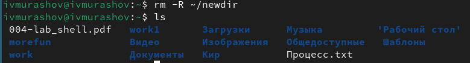

## Выполнение лабораторной работы

Удаляю каталог morefun из домашнего каталога. Проверяю, был ли каталог удалён.

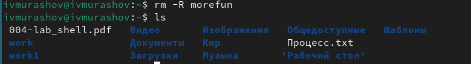

## Выполнение лабораторной работы

С помощью команды man определяю, какую опцию команды ls нужно использовать для просмотра содержимое не только указанного каталога, но и подкаталогов, входящих в него. Необходимо использовать опцию '*'.

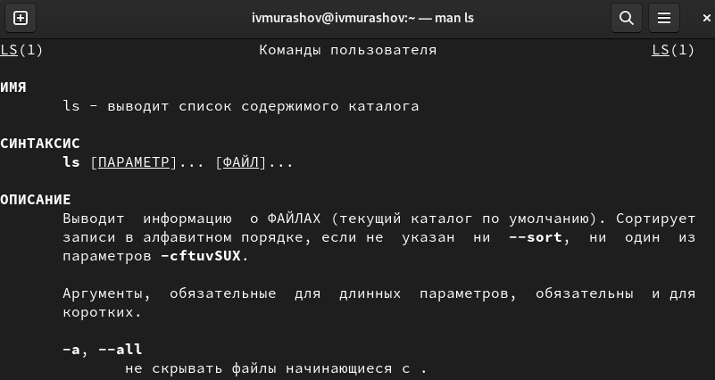

## Выполнение лабораторной работы

С помощью команды man определяю набор опций команды ls, позволяющий отсортировать по времени последнего изменения выводимый список содержимого каталога с развёрнутым описанием файлов.

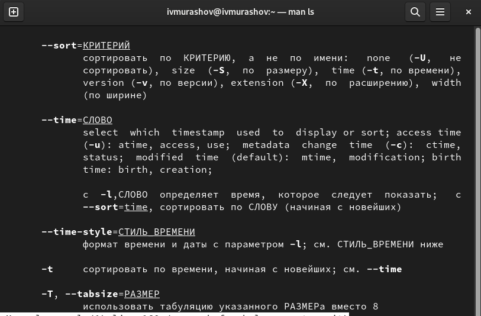

## Выполнение лабораторной работы

Использую команду man для просмотра описания следующих команд: cd, pwd, mkdir, rmdir, rm.

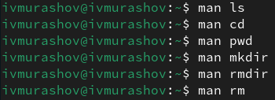

## Выполнение лабораторной работы

Основные опции команды cd:

- -P-e - позволяет выйти с ошибкой, если директория, в которую осуществляется переход, не найдена.
- .. - позволяет перейти в предыдущий каталог.
- ~ - возвращает в домашний каталог.

Основные опции команды pwd:

- P - отбрасывает все символические ссылки.
- --help - отображает справку по утилите.
- --version - отображает версию утилиты.

## Выполнение лабораторной работы

Основные опции команды mkdir:

- <drive> - указывает диск, на котором нужно создать новый каталог. 
- <path>	- указывает имя и расположение нового каталога (обязательный параметр).
- /? - отображает справку в командной строке.

Основные опции команды rmdir:

- -p - позволяет удалить директорию и ее родительские директории, если они остаются пустыми после удаления. 
- --ignore-fail-on-non-empty - позволяет проигнорировать сообщение об ошибке, если директория не пустая. 
- --verbose - выводит подробную информацию о процессе удаления директории

## Выполнение лабораторной работы

Основные опции команды rm:

- -r - позволяет удалить не пустую директорию
- -i - выводит запрос на подтверждение каждой операции удаления.
- -f - не возвращает код ошибочного завершения, если ошибки были вызваны несуществующими файлами.

## Выполнение лабораторной работы

Используя информацию, полученную при помощи команды history, выполняю модификацию и исполнение команды номер 1025 из буфера обмена (ls -l - заменяю '-l' на '-a').

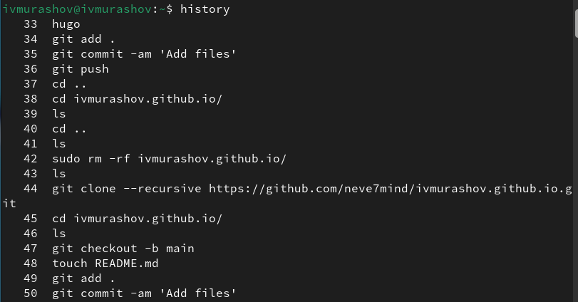

## Выполнение лабораторной работы

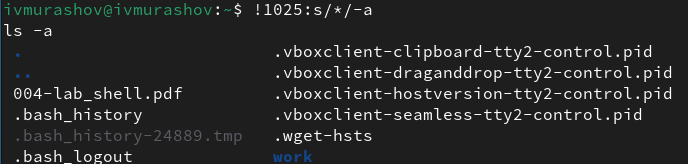

## Выводы

В ходе выполнения данной лабораторной работы я получил практические навыки взаимодействия пользователя с системой посредством командной строки.

