---
## Front matter
lang: ru-RU
title: Лабораторная работа №7
subtitle: Операционные системы
author:
  - Мурашов И. В., НКАбд-04-23
institute:
  - Российский университет дружбы народов, Москва, Россия
  
date: 21 марта 2024

## i18n babel
babel-lang: russian
babel-otherlangs: english

## Formatting pdf
toc: false
toc-title: Содержание
slide_level: 2
aspectratio: 169
section-titles: true
theme: metropolis
header-includes:
 - \metroset{progressbar=frametitle,sectionpage=progressbar,numbering=fraction}
 - '\makeatletter'
 - '\beamer@ignorenonframefalse'
 - '\makeatother'
 
## Fonts
mainfont: PT Serif
romanfont: PT Serif
sansfont: PT Sans
monofont: PT Mono
mainfontoptions: Ligatures=TeX
romanfontoptions: Ligatures=TeX
sansfontoptions: Ligatures=TeX,Scale=MatchLowercase
monofontoptions: Scale=MatchLowercase,Scale=0.9
---

## Докладчик

:::::::::::::: {.columns align=center}
::: {.column width="70%"}

  * Мурашов Иван Вячеславович
  * Cтудент, 1 курс, группа НКАбд-04-23
  * Российский университет дружбы народов
  * Факультет физико-математических и естественных наук
  * [1132236018@rudn.ru](mailto:1132236018@rudn.ru)
  * <https://neve7mind.github.io>

:::
::: {.column width="30%"}

:::
::::::::::::::

## Цель работы

Целью данной лабораторной работы является ознакомление с файловой системой Linux, её структурой, именами и содержанием каталогов. Приобретение практических навыков по применению команд для работы с файлами и каталогами, по управлению процессами (и работами), по проверке использования диска и обслуживанию файловой системы.

## Выполнение лабораторной работы

Копирование файла в текущем каталоге. Скопировать файл ~/abc1 в файл april и в файл may.

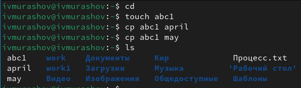

## Выполнение лабораторной работы

Копирование нескольких файлов в каталог. Скопировать файлы april и may в каталог monthly.

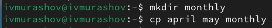

## Выполнение лабораторной работы

Копирование файлов в произвольном каталоге.Скопировать файл monthly/may в файл с именем june.

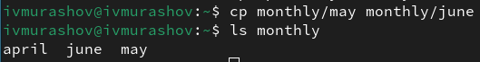

## Выполнение лабораторной работы

Копирование каталогов в текущем каталоге. Скопировать каталог monthly в каталог monthly.00 и копирование каталогов в произвольном каталоге. Скопировать каталог monthly.00 в каталог /tmp.

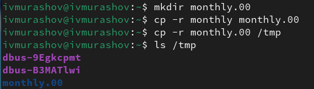

## Выполнение лабораторной работы

Перемещение файлов в другой каталог. Переместить файл july в каталог monthly.00.

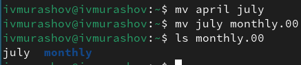

## Выполнение лабораторной работы

Переименование каталогов в текущем каталоге. Переименовать каталог monthly.00 в monthly.01. Перемещение каталога в другой каталог. Переместить каталог monthly.01в каталог reports. Переименование каталога, не являющегося текущим. Переименовать каталог reports/monthly.01 в reports/monthly.

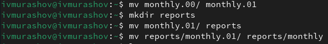

## Выполнение лабораторной работы

Требуется создать файл ~/may с правом выполнения для владельца.

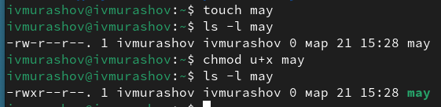

## Выполнение лабораторной работы

Требуется лишить владельца файла ~/may права на выполнение.

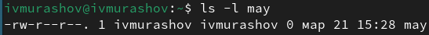

## Выполнение лабораторной работы

Требуется создать каталог monthly с запретом на чтение для членов группы и всех остальных пользователей. Требуется создать файл ~/abc1 с правом записи для членов группы.

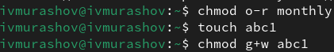

## Выполнение лабораторной работы

Для просмотра используемых в операционной системе файловых систем можно воспользоваться командой mount без параметров. В результате её применения можно получить примерно следующее.

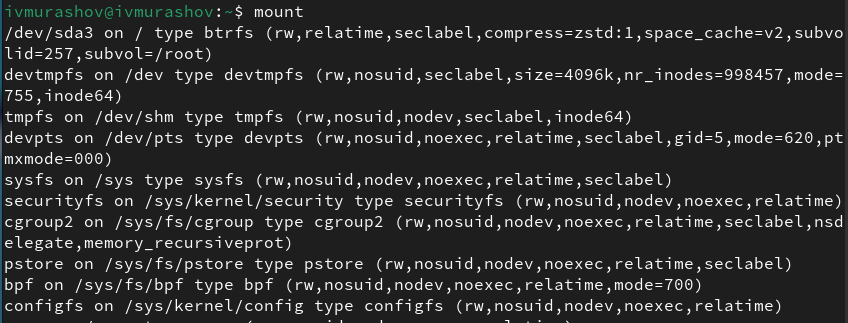

## Выполнение лабораторной работы

Другой способ определения смонтированных в операционной системе файловых систем — просмотр файла/etc/fstab. Сделать это можно например с помощью команды cat.

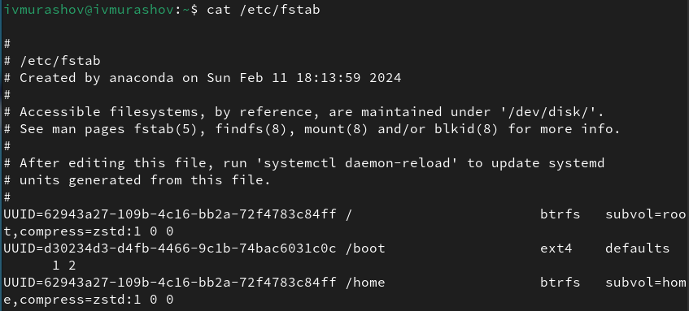

## Выполнение лабораторной работы

Для определения объёма свободного пространства на файловой системе можно воспользоваться командой df, которая выведет на экран список всех файловых систем в соответствии с именами устройств, с указанием размера и точки монтирования.

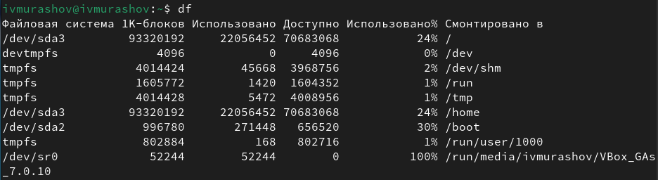

## Выполнение лабораторной работы

Скопируйте файл /usr/include/sys/io.h в домашний каталог и назовите его equipment. В домашнем каталоге создайте директорию ~/ski.plases. Переместите файл equipment в каталог ~/ski.plases. Переименуйте файл ~/ski.plases/equipment в ~/ski.plases equiplist. Создайте в домашнем каталоге файл abc1 и скопируйте его в каталог ~/ski.plases, назовите его equiplist2.

## Выполнение лабораторной работы

Создайте каталог с именем equipment в каталоге ~/ski.plases. Переместите файлы ~/ski.plases/equiplist и equiplist2 в каталог ~/ski.plases/equipment.

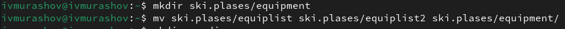

## Выполнение лабораторной работы

Создайте и переместите каталог ~/newdir в каталог ~/ski.plases и назовите его plans.

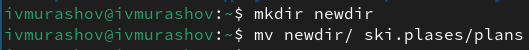

## Выполнение лабораторной работы

Создаю необходимые файлы.

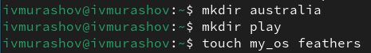

## Выполнение лабораторной работы

Определите опции команды chmod, необходимые для того, чтобы присвоить перечисленным ниже файлам выделенные права доступа, считая, что в начале таких прав нет:

1. drwxr--r-- ... australia.

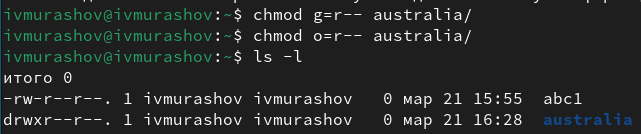

## Выполнение лабораторной работы

2. drwx--x--x ... play.

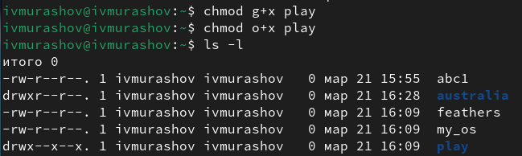

## Выполнение лабораторной работы

3. -r-xr--r-- ... my_os.

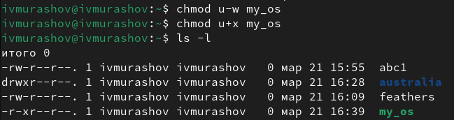## Выполнение лабораторной работы

## Выполнение лабораторной работы

4. -rw-rw-r-- ... feathers. 

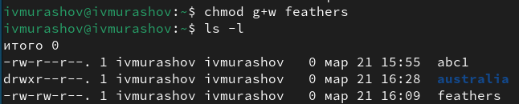

## Выполнение лабораторной работы

Просмотрите содержимое файла /etc/password.

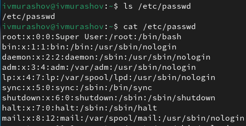

## Выполнение лабораторной работы

Скопируйте файл ~/feathers в файл ~/file.old. Переместите файл ~/file.old в каталог ~/play. 

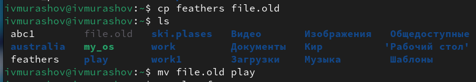

## Выполнение лабораторной работы

Скопируйте каталог ~/play в каталог ~/fun. Переместите каталог ~/fun в каталог ~/play и назовите его games.

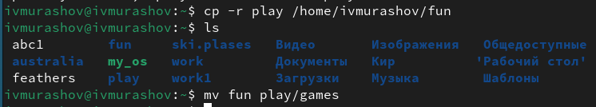

## Выполнение лабораторной работы

Переместите каталог ~/fun в каталог ~/play и назовите его games. Лишите владельца файла ~/feathers права на чтение.

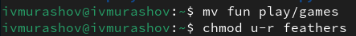

## Выполнение лабораторной работы

Что произойдёт, если вы попытаетесь просмотреть файл ~/feathers командой cat? - Будет отказано в доступе.
Что произойдёт, если вы попытаетесь скопировать файл ~/feathers? - Будет отказано в доступе.
Дайте владельцу файла ~/feathers право на чтение.

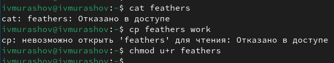

## Выполнение лабораторной работы

Лишите владельца каталога ~/play права на выполнение. Перейдите в каталог ~/play. Что произошло? - Отказано в доступе. Дайте владельцу каталога ~/play право на выполнение.

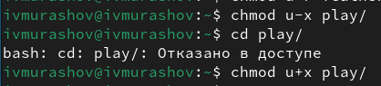

## Выполнение лабораторной работы

Читаю man по командам mount, fsck, mkfs, kill.

- mount — утилита командной строки в UNIX-подобных операционных системах. Применяется для монтирования файловых систем.
- fsck (проверка файловой системы) - это утилита командной строки, которая позволяет выполнять проверки согласованности и интерактивное исправление в одной или нескольких файловых системах Linux. Он использует программы, специфичные для типа файловой системы, которую он проверяет.
- mkfs используется для создания файловой системы Linux на некотором устройстве, обычно в разделе жёсткого диска. В качестве аргумента filesys для файловой системы может выступать или название устройства

## Выполнение лабораторной работы

- Команда Kill посылает указанный сигнал указанному процессу. Если не указано ни одного сигнала, посылается сигнал SIGTERM. Сигнал SIGTERM завершает лишь те процессы, которые не обрабатывают его приход. Для других процессов может быть необходимым послать сигнал SIGKILL, поскольку этот сигнал перехватить невозможно.

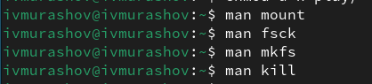

## Выводы

В ходе выполнения данной лабораторной работы я ознакомился с файловой системой Linux, её структурой, именами и содержанием каталогов. Приобрел практические навыкы по применению команд для работы с файлами и каталогами, по управлению процессами (и работами), по проверке использования диска и обслуживанию файловой системы.

