---
## Front matter
title: "Отчёт по лабораторной работе №7"
subtitle: "Операционные системы"
author: "Мурашов Иван Вячеславович"

## Generic otions
lang: ru-RU
toc-title: "Содержание"

## Bibliography
bibliography: bib/cite.bib
csl: pandoc/csl/gost-r-7-0-5-2008-numeric.csl

## Pdf output format
toc: true # Table of contents
toc-depth: 2
lof: true # List of figures
lot: true # List of tables
fontsize: 12pt
linestretch: 1.5
papersize: a4
documentclass: scrreprt
## I18n polyglossia
polyglossia-lang:
  name: russian
  options:
	- spelling=modern
	- babelshorthands=true
polyglossia-otherlangs:
  name: english
## I18n babel
babel-lang: russian
babel-otherlangs: english
## Fonts
mainfont: PT Serif
romanfont: PT Serif
sansfont: PT Sans
monofont: PT Mono
mainfontoptions: Ligatures=TeX
romanfontoptions: Ligatures=TeX
sansfontoptions: Ligatures=TeX,Scale=MatchLowercase
monofontoptions: Scale=MatchLowercase,Scale=0.9
## Biblatex
biblatex: true
biblio-style: "gost-numeric"
biblatexoptions:
  - parentracker=true
  - backend=biber
  - hyperref=auto
  - language=auto
  - autolang=other*
  - citestyle=gost-numeric
## Pandoc-crossref LaTeX customization
figureTitle: "Рис."
tableTitle: "Таблица"
listingTitle: "Листинг"
lofTitle: "Список иллюстраций"
lotTitle: "Список таблиц"
lolTitle: "Листинги"
## Misc options
indent: true
header-includes:
  - \usepackage{indentfirst}
  - \usepackage{float} # keep figures where there are in the text
  - \floatplacement{figure}{H} # keep figures where there are in the text
---

# Цель работы

Целью данной лабораторной работы является ознакомление с файловой системой Linux, её структурой, именами и содержанием каталогов. Приобретение практических навыков по применению команд для работы с файлами и каталогами, по управлению процессами (и работами), по проверке использования диска и обслуживанию файловой системы.

# Задание

1. Выполнение примеров, приведённых в первой части описания лабораторной работы

2. Работа с файлами и каталогами

3. Настройка прав доступа

4. Выполнение упражнений

# Выполнение лабораторной работы

## Выполнение примеров, приведённых в первой части описания лабораторной работы

Копирование файла в текущем каталоге. Скопировать файл ~/abc1 в файл april и в файл may (рис. [-@fig:001]).

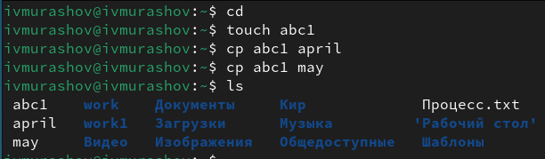{#fig:001 width=70%}

Копирование нескольких файлов в каталог. Скопировать файлы april и may в каталог monthly (рис. [-@fig:002]).

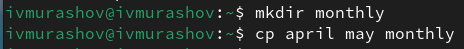{#fig:002 width=70%}

Копирование файлов в произвольном каталоге.Скопировать файл monthly/may в файл с именем june (рис. [-@fig:003]).

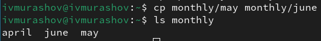{#fig:003 width=70%}

Копирование каталогов в текущем каталоге. Скопировать каталог monthly в каталог monthly.00 и копирование каталогов в произвольном каталоге. Скопировать каталог monthly.00 в каталог /tmp (рис. [-@fig:004]).

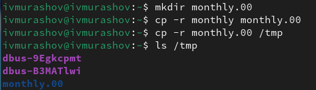{#fig:004 width=70%}

Перемещение файлов в другой каталог. Переместить файл july в каталог monthly.00 (рис. [-@fig:005]).

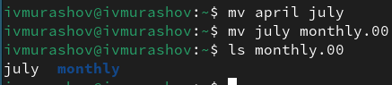{#fig:005 width=70%}

Переименование каталогов в текущем каталоге. Переименовать каталог monthly.00 в monthly.01. Перемещение каталога в другой каталог. Переместить каталог monthly.01в каталог reports. Переименование каталога, не являющегося текущим. Переименовать каталог reports/monthly.01 в reports/monthly (рис. [-@fig:006]).

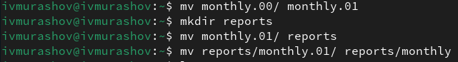{#fig:006 width=70%}

Требуется создать файл ~/may с правом выполнения для владельца (рис. [-@fig:007]).

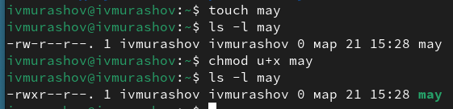{#fig:007 width=70%}

Требуется лишить владельца файла ~/may права на выполнение (рис. [-@fig:008]).

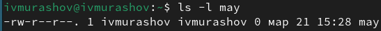{#fig:008 width=70%}

Требуется создать каталог monthly с запретом на чтение для членов группы и всех остальных пользователей. Требуется создать файл ~/abc1 с правом записи для членов группы (рис. [-@fig:009]).

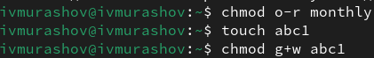{#fig:009 width=70%}

Для просмотра используемых в операционной системе файловых систем можно воспользоваться командой mount без параметров. В результате её применения можно получить примерно следующее (рис. [-@fig:010]).

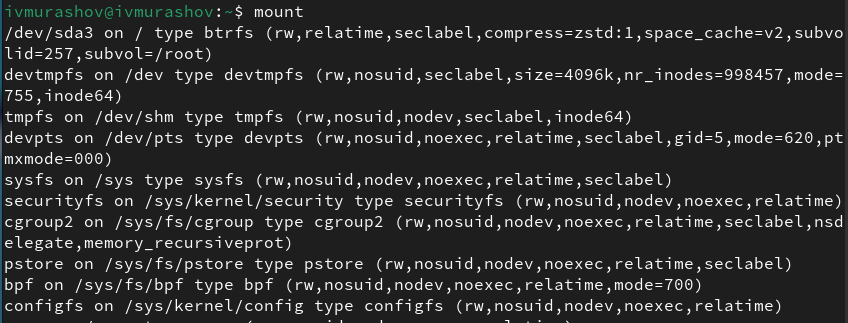{#fig:010 width=70%}

Другой способ определения смонтированных в операционной системе файловых систем — просмотр файла/etc/fstab. Сделать это можно например с помощью команды cat (рис. [-@fig:011]).

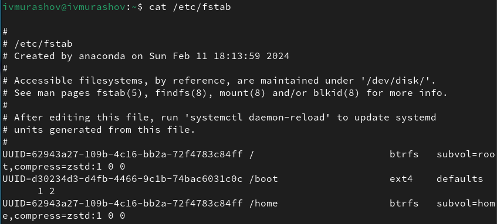{#fig:011 width=70%}

Для определения объёма свободного пространства на файловой системе можно воспользоваться командой df, которая выведет на экран список всех файловых систем в соответствии с именами устройств, с указанием размера и точки монтирования (рис. [-@fig:012]).

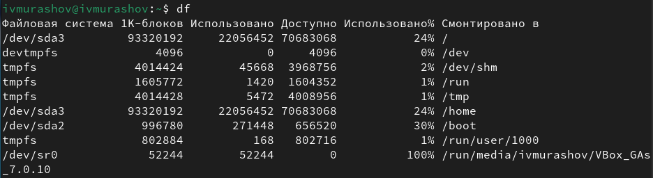{#fig:012 width=70%}

## Работа с файлами и каталогами

Скопируйте файл /usr/include/sys/io.h в домашний каталог и назовите его equipment. В домашнем каталоге создайте директорию ~/ski.plases. Переместите файл equipment в каталог ~/ski.plases. Переименуйте файл ~/ski.plases/equipment в ~/ski.plases equiplist. Создайте в домашнем каталоге файл abc1 и скопируйте его в каталог ~/ski.plases, назовите его equiplist2. (рис. [-@fig:013]). 

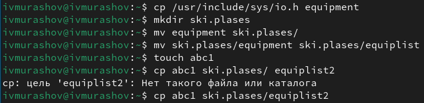{#fig:013 width=70%}

Создайте каталог с именем equipment в каталоге ~/ski.plases. Переместите файлы ~/ski.plases/equiplist и equiplist2 в каталог ~/ski.plases/equipment (рис. [-@fig:014]). 

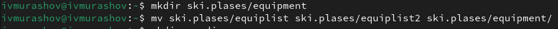{#fig:014 width=70%}

Создайте и переместите каталог ~/newdir в каталог ~/ski.plases и назовите его plans (рис. [-@fig:015]). 

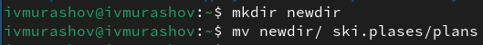{#fig:015 width=70%}

## Настройка прав доступа

Создаю необходимые файлы (рис. [-@fig:016]). 

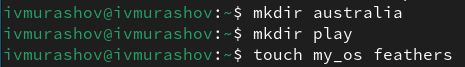{#fig:016 width=70%}

Определите опции команды chmod, необходимые для того, чтобы присвоить перечисленным ниже файлам выделенные права доступа, считая, что в начале таких прав нет:

1. drwxr--r-- ... australia (рис. [-@fig:017]). 

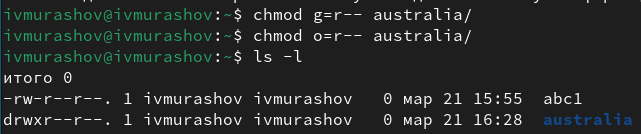{#fig:017 width=70%}

2. drwx--x--x ... play (рис. [-@fig:018]). 

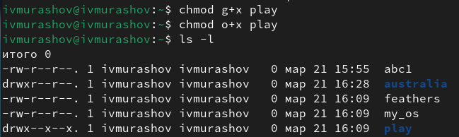{#fig:018 width=70%}

3. -r-xr--r-- ... my_os (рис. [-@fig:019]). 

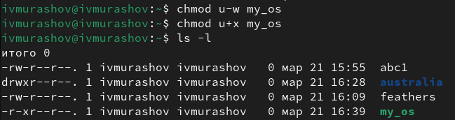{#fig:019 width=70%}

4. -rw-rw-r-- ... feathers (рис. [-@fig:020]). 

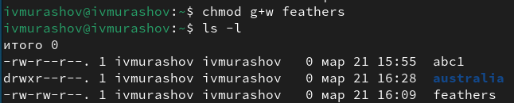{#fig:020 width=70%}

## Выполнение упражнений

Просмотрите содержимое файла /etc/password (рис. [-@fig:021]). 

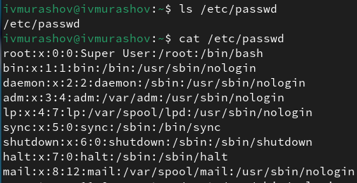{#fig:021 width=70%}

Скопируйте файл ~/feathers в файл ~/file.old. Переместите файл ~/file.old в каталог ~/play (рис. [-@fig:022]). 

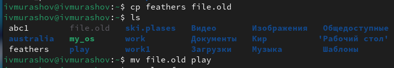{#fig:022 width=70%}

Скопируйте каталог ~/play в каталог ~/fun. Переместите каталог ~/fun в каталог ~/play и назовите его games (рис. [-@fig:023]). 

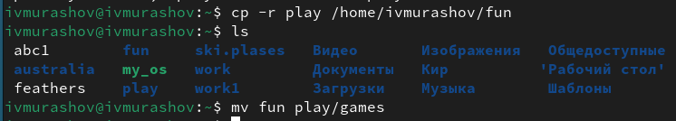{#fig:023 width=70%}

Переместите каталог ~/fun в каталог ~/play и назовите его games. Лишите владельца файла ~/feathers права на чтение (рис. [-@fig:024]). 

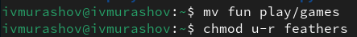{#fig:024 width=70%}

Что произойдёт, если вы попытаетесь просмотреть файл ~/feathers командой cat? - Будет отказано в доступе.
Что произойдёт, если вы попытаетесь скопировать файл ~/feathers? - Будет отказано в доступе.
Дайте владельцу файла ~/feathers право на чтение (рис. [-@fig:025]). 

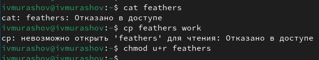{#fig:025 width=70%}

Лишите владельца каталога ~/play права на выполнение. Перейдите в каталог ~/play. Что произошло? - Отказано в доступе. Дайте владельцу каталога ~/play право на выполнение (рис. [-@fig:026]). 

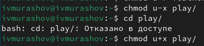{#fig:026 width=70%}

Читаю man по командам mount, fsck, mkfs, kill (рис. [-@fig:027]). 

- mount — утилита командной строки в UNIX-подобных операционных системах. Применяется для монтирования файловых систем.
- fsck (проверка файловой системы) - это утилита командной строки, которая позволяет выполнять проверки согласованности и интерактивное исправление в одной или нескольких файловых системах Linux. Он использует программы, специфичные для типа файловой системы, которую он проверяет.
- mkfs используется для создания файловой системы Linux на некотором устройстве, обычно в разделе жёсткого диска. В качестве аргумента filesys для файловой системы может выступать или название устройства
- Команда Kill посылает указанный сигнал указанному процессу. Если не указано ни одного сигнала, посылается сигнал SIGTERM. Сигнал SIGTERM завершает лишь те процессы, которые не обрабатывают его приход. Для других процессов может быть необходимым послать сигнал SIGKILL, поскольку этот сигнал перехватить невозможно.

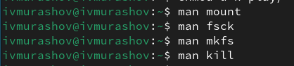{#fig:027 width=70%}

## Ответы на контрольные вопросы

1. Дайте характеристику каждой файловой системе, существующей на жёстком диске компьютера, на котором вы выполняли лабораторную работу.

Ext2, Ext3, Ext4 или Extended Filesystem - это стандартная файловая система для Linux. Она была разработана еще для Minix. Она самая стабильная из всех существующих, кодовая база изменяется очень редко и эта файловая система содержит больше всего функций. Версия ext2 была разработана уже именно для Linux и получила много улучшений. В 2001 году вышла ext3, которая добавила еще больше стабильности благодаря использованию журналирования. В 2006 была выпущена версия ext4, которая используется во всех дистрибутивах Linux до сегодняшнего дня. В ней было внесено много улучшений, в том числе увеличен максимальный размер раздела до одного экзабайта.

Btrfs или B-Tree File System - это совершенно новая файловая система, которая сосредоточена на отказоустойчивости, легкости администрирования и восстановления данных. Файловая система объединяет в себе очень много новых интересных возможностей, таких как размещение на нескольких разделах, поддержка подтомов, изменение размера не лету, создание мгновенных снимков, а также высокая производительность. Но многими пользователями файловая система Btrfs считается нестабильной. Тем не менее, она уже используется как файловая система по умолчанию в OpenSUSE и SUSE Linux.

2. Приведите общую структуру файловой системы и дайте характеристику каждой директории первого уровня этой структуры.

/ — root каталог. Содержит в себе всю иерархию системы;

/bin — здесь находятся двоичные исполняемые файлы. Основные общие команды, хранящиеся отдельно от других программ в системе (прим.: pwd, ls, cat, ps);

/boot — тут расположены файлы, используемые для загрузки системы (образ initrd, ядро vmlinuz);

/dev — в данной директории располагаются файлы устройств (драйверов). С помощью этих файлов можно взаимодействовать с устройствами. К примеру, если это жесткий диск, можно подключить его к файловой системе. В файл принтера же можно написать напрямую и отправить задание на печать;

/etc — в этой директории находятся файлы конфигураций программ. Эти файлы позволяют настраивать системы, сервисы, скрипты системных демонов;

/home — каталог, аналогичный каталогу Users в Windows. Содержит домашние каталоги учетных записей пользователей (кроме root). При создании нового пользователя здесь создается одноименный каталог с аналогичным именем и хранит личные файлы этого пользователя;

/lib — содержит системные библиотеки, с которыми работают программы и модули ядра;

/lost+found — содержит файлы, восстановленные после сбоя работы системы. Система проведет проверку после сбоя и найденные файлы можно будет посмотреть в данном каталоге;

/media — точка монтирования внешних носителей. Например, когда вы вставляете диск в дисковод, он будет автоматически смонтирован в директорию /media/cdrom;

/mnt — точка временного монтирования. Файловые системы подключаемых устройств обычно монтируются в этот каталог для временного использования;

/opt — тут расположены дополнительные (необязательные) приложения. Такие программы обычно не подчиняются принятой иерархии и хранят свои файлы в одном подкаталоге (бинарные, библиотеки, конфигурации);

/proc — содержит файлы, хранящие информацию о запущенных процессах и о состоянии ядра ОС;

/root — директория, которая содержит файлы и личные настройки суперпользователя;

/run — содержит файлы состояния приложений. Например, PID-файлы или UNIX-сокеты;

/sbin — аналогично /bin содержит бинарные файлы. Утилиты нужны для настройки и администрирования системы суперпользователем;

/srv — содержит файлы сервисов, предоставляемых сервером (прим. FTP или Apache HTTP);

/sys — содержит данные непосредственно о системе. Тут можно узнать информацию о ядре, драйверах и устройствах;

/tmp — содержит временные файлы. Данные файлы доступны всем пользователям на чтение и запись. Стоит отметить, что данный каталог очищается при перезагрузке;

/usr — содержит пользовательские приложения и утилиты второго уровня, используемые пользователями, а не системой. Содержимое доступно только для чтения (кроме root). Каталог имеет вторичную иерархию и похож на корневой;

/var — содержит переменные файлы. Имеет подкаталоги, отвечающие за отдельные переменные. Например, логи будут храниться в /var/log, кэш в /var/cache, очереди заданий в /var/spool/ и так далее.

3. Какая операция должна быть выполнена, чтобы содержимое некоторой файловой системы было доступно операционной системе?

Монтирование тома.

4. Назовите основные причины нарушения целостности файловой системы. Как устранить повреждения файловой системы?

Отсутствие синхронизации между образом файловой системы в памяти и ее данными на диске в случае аварийного останова может привести к появлению следующих ошибок:

Один блок адресуется несколькими mode (принадлежит нескольким файлам).
Блок помечен как свободный, но в то же время занят (на него ссылается onode).
Блок помечен как занятый, но в то же время свободен (ни один inode на него не ссылается).
Неправильное число ссылок в inode (недостаток или избыток ссылающихся записей в каталогах).
Несовпадение между размером файла и суммарным размером адресуемых inode блоков.
Недопустимые адресуемые блоки (например, расположенные за пределами файловой системы).
"Потерянные" файлы (правильные inode, на которые не ссылаются записи каталогов).
Недопустимые или неразмещенные номера inode в записях каталогов.

5. Как создаётся файловая система? mkfs - позволяет создать файловую систему Linux.

6. Дайте характеристику командам для просмотра текстовых файлов.
Cat - выводит содержимое файла на стандартное устройство вывода. Выполнение команды head выведет первые 10 строк текстового файла. Выполнение команды tail выведет последние 10 строк текстового файла. Команда tac - это тоже самое, что и cat, только отображает строки в обратном порядке. Для того, чтобы просмотреть огромный текстовый файл применяются команды для постраничного просмотра. Такие как more и less.

7. Приведите основные возможности команды cp в Linux.
Cp – копирует или перемещает директорию, файлы.

8. Приведите основные возможности команды mv в Linux.
Mv - переименовать или переместить файл или директорию

9. Что такое права доступа? Как они могут быть изменены?
Права доступа к файлу или каталогу можно изменить, воспользовавшись командой chmod. Сделать это может владелец файла (или каталога) или пользователь с правами администратора.

# Выводы

В ходе выполнения данной лабораторной работы я ознакомился с файловой системой Linux, её структурой, именами и содержанием каталогов. Приобрел практические навыкы по применению команд для работы с файлами и каталогами, по управлению процессами (и работами), по проверке использования диска и обслуживанию файловой системы.

# Список литературы{.unnumbered}

1. [Электронный ресурс](https://esystem.rudn.ru/pluginfile.php/2288087/mod_resource/content/4/005-lab_files.pdf)

