---
## Front matter
lang: ru-RU
title: Лабораторная работа №8
subtitle: Операционные системы
author:
  - Мурашов И. В., НКАбд-04-23
institute:
  - Российский университет дружбы народов, Москва, Россия
  
date: 27 марта 2024

## i18n babel
babel-lang: russian
babel-otherlangs: english

## Formatting pdf
toc: false
toc-title: Содержание
slide_level: 2
aspectratio: 169
section-titles: true
theme: metropolis
header-includes:
 - \metroset{progressbar=frametitle,sectionpage=progressbar,numbering=fraction}
 - '\makeatletter'
 - '\beamer@ignorenonframefalse'
 - '\makeatother'
 
## Fonts
mainfont: PT Serif
romanfont: PT Serif
sansfont: PT Sans
monofont: PT Mono
mainfontoptions: Ligatures=TeX
romanfontoptions: Ligatures=TeX
sansfontoptions: Ligatures=TeX,Scale=MatchLowercase
monofontoptions: Scale=MatchLowercase,Scale=0.9
---

## Докладчик

:::::::::::::: {.columns align=center}
::: {.column width="70%"}

  * Мурашов Иван Вячеславович
  * Cтудент, 1 курс, группа НКАбд-04-23
  * Российский университет дружбы народов
  * Факультет физико-математических и естественных наук
  * [1132236018@rudn.ru](mailto:1132236018@rudn.ru)
  * <https://neve7mind.github.io>

:::
::: {.column width="30%"}

:::
::::::::::::::

## Цель работы

Целью данной лабораторной работы является ознакомление с инструментами поиска файлов и фильтрации текстовых данных. Приобретение практических навыков: по управлению процессами (и заданиями), по проверке использования диска и обслуживанию файловых систем.

## Выполнение лабораторной работы

Осуществляю вход в систему, используя соответствующее имя пользователя и записываю в файл file.txt названия файлов, содержащихся в каталоге /etc.

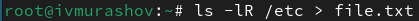

## Выполнение лабораторной работы

Дописываю в этот же файл названия файлов, содержащихся в вашем домашнем каталоге.

## Выполнение лабораторной работы

Вывожу имена всех файлов из file.txt, имеющих расширение .conf.

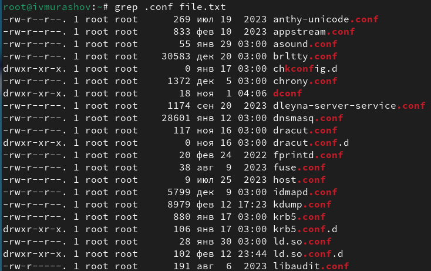

## Выполнение лабораторной работы

Записываю данные файлы в новый текстовой файл conf.txt.

## Выполнение лабораторной работы

Определяю, какие файлы в вашем домашнем каталоге имеют имена, начинавшиеся с символа "c" с помощью команд find и grep.

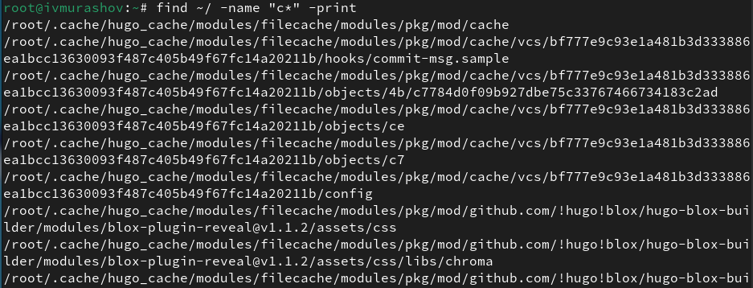

## Выполнение лабораторной работы

И с помощью команд ls и grep.

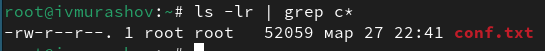

## Выполнение лабораторной работы

Вывожу на экран имена файлов из каталога /etc, начинающиеся с символа h.

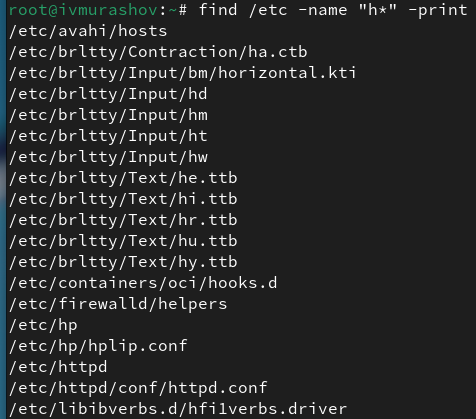

## Выполнение лабораторной работы

Запускаю в фоновом режиме процесс, который будет записывать в файл ~/logfile файлы, имена которых начинаются с log.

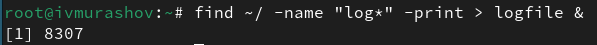

## Выполнение лабораторной работы

Удаляю файл ~/logfile.

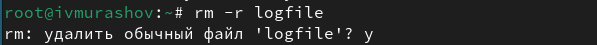

## Выполнение лабораторной работы

Запускаю из консоли в фоновом режиме редактор mcedit.

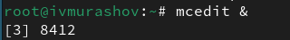

## Выполнение лабораторной работы

Определяю идентификатор процесса gedit, используя команду ps, конвейер и фильтр grep с помощью команд ps и grep различными способами.

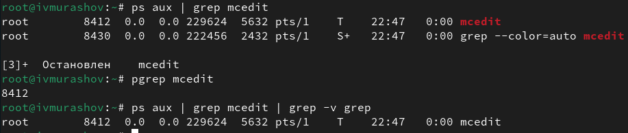

## Выполнение лабораторной работы

Прочитав справку (man) команды kill, использую её для завершения процесса mcedit.

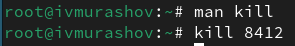

## Выполнение лабораторной работы

Выполняю команды df и du, предварительно получив более подробную информацию об этих командах, с помощью команды man. 

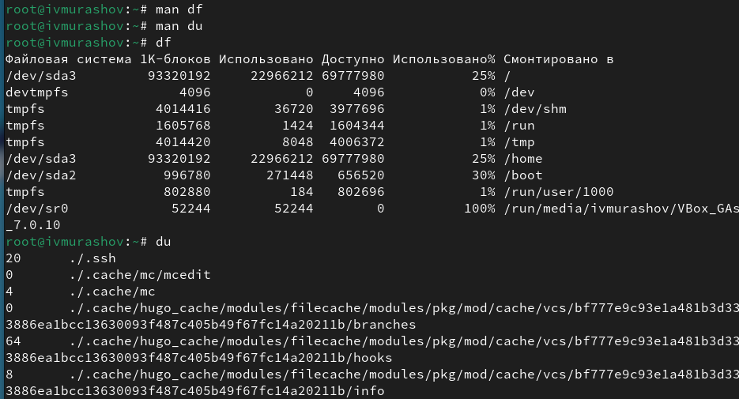

## Выполнение лабораторной работы

Воспользовавшись справкой команды find, вывожу имена всех директорий, имеющихся в домашнем каталоге. 

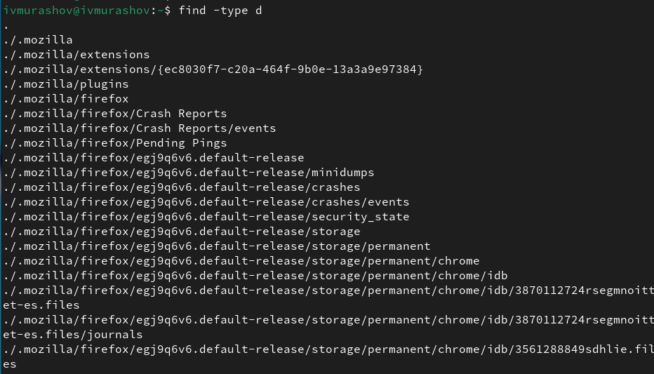

## Выводы

В ходе выполнения данной лабораторной работы я ознакомился с инструментами поиска файлов и фильтрации текстовых данных. Приобрёл практические навыки: по управлению процессами (и заданиями), по проверке использования диска и обслуживанию файловых систем.

