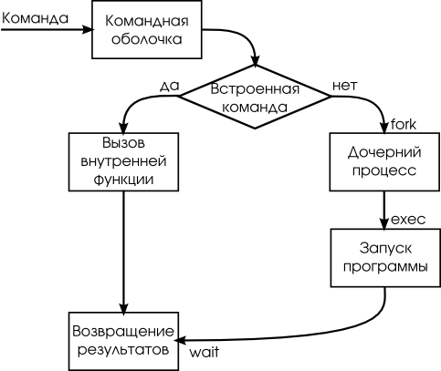
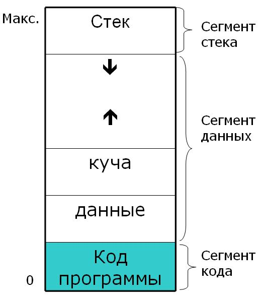
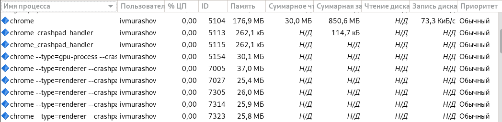
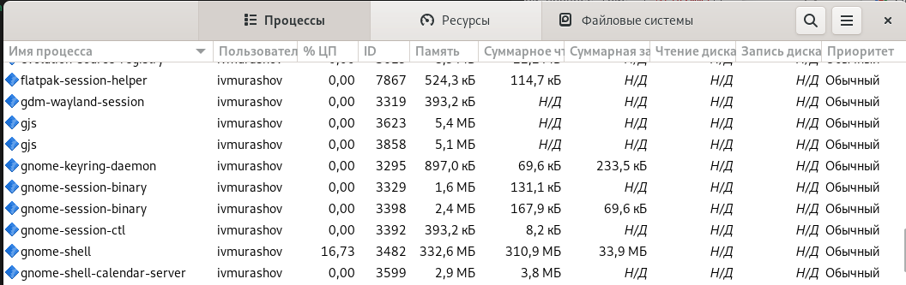
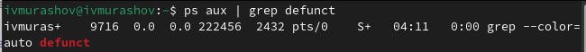
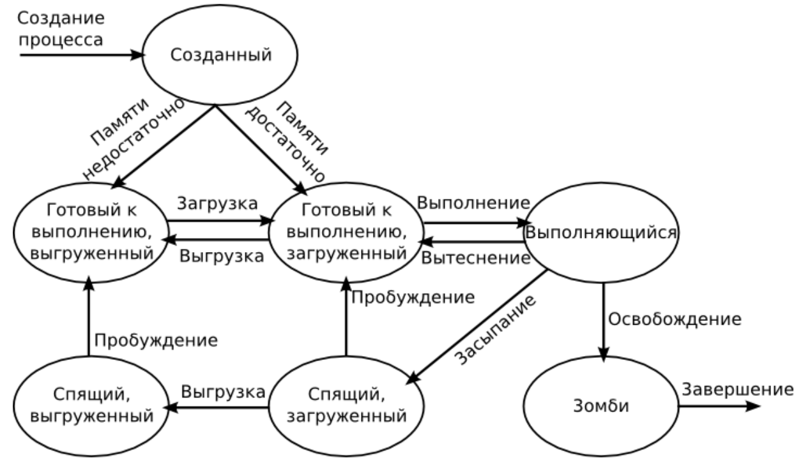

---
## Front matter
lang: ru-RU
title: Индивидуальный доклад по теме <<Понятие процесса, виды процессов и его состояния в операционных системах>>
subtitle: Операционные системы
author:
  - Мурашов И. В., НКАбд-04-23
institute:
  - Российский университет дружбы народов, Москва, Россия
  
date: 08 марта 2024

## i18n babel
babel-lang: russian
babel-otherlangs: english

## Formatting pdf
toc: false
toc-title: Содержание
slide_level: 2
aspectratio: 169
section-titles: true
theme: metropolis
header-includes:
 - \metroset{progressbar=frametitle,sectionpage=progressbar,numbering=fraction}
 - '\makeatletter'
 - '\beamer@ignorenonframefalse'
 - '\makeatother'
 
## Fonts
mainfont: PT Serif
fontsize: 10pt
romanfont: PT Serif
fontsize: 10pt
sansfont: PT Sans
fontsize: 10pt
monofont: PT Mono
fontsize: 10pt
mainfontoptions: Ligatures=TeX
romanfontoptions: Ligatures=TeX
sansfontoptions: Ligatures=TeX,Scale=MatchLowercase
monofontoptions: Scale=MatchLowercase,Scale=0.9
---

## Докладчик

:::::::::::::: {.columns align=center}
::: {.column width="70%"}

  * Мурашов Иван Вячеславович
  * Cтудент, 1 курс, группа НКАбд-04-23
  * Факультет физико-математических и естественных наук
  * Российский университет дружбы народов
  * [1132236018@rudn.ru](mailto:1132236018@rudn.ru)
  * <https://neve7mind.github.io>

:::
::: {.column width="30%"}

:::
::::::::::::::

## Цель работы

Целью данного исследования является приобретение знаний по теме "Понятие процесса, виды процессов и его состояния в операционных системах" и составление содержательного доклада по данной теме.

# Понятие процесса

Процесс - это программа или команда, выполняемая на компьютере. С помощью команд вы сообщаете операционной системе, какую задачу ей следует выполнить.

{width=50%}

## Ресурсы, которыми владеет процесс

Обычно процесс в вычислительной системе представлен (также говорят, «владеет») следующими ресурсами:

- образом исполняемого машинного кода, ассоциированного с программой;
- памятью (обычно некоторой областью виртуальной памяти);
- дескрипторами ресурсов операционной системы, выделенными для процесса, например, файл
- файловыми дескрипторами;
- атрибутами безопасности, такими как владелец и набор полномочий процесса (допустимых операций);
- состоянием процессора (контекстом), таким как:
    - содержимое регистров;
    - схема преобразования виртуальных адресов в физические;
    - и т. д.
    
Контекст текущего процесса выгружается в память, когда выполняется переключение на другой процесс.

## Ресурсы, которыми владеет процесс

{width=30%}

# Виды процессов

## Интерактивные и фоновые процессы

Интерактивными называются процессы, которые запускаются пользователем, и те процессы, в работе которых принимает участие пользователь. Процессы, выполняемые независимо от пользователя, называются фоновыми. По умолчанию программы и команды выполняются как интерактивные процессы.

{width=70%}

## Демоны

Демоны - это процессы, выполняемые автономно. Они постоянно работают в фоновом режиме. Обычно демоны запускаются вместе с системой и завершают работу вместе с ней. Как правило, демоны обеспечивают работу системных служб и доступны в каждый момент времени нескольким задачам и пользователям. Демоны запускаются пользователем root или оболочкой root и могут быть завершены только пользователем root. Например, демон qdaemon предоставляет доступ к системным ресурсам (принтерам и т.п.).

{width=70%}

## Процессы-зомби

Процесс-зомби - это неактивный процесс, который по-прежнему находится в таблице процессов (иными словами, он сохраняет свой ID процесса). Ему не выделяется системная память. Процессы-зомби - это процессы, которые были прерваны или завершены, но продолжают существовать в таблице процессов до тех пор, не будет завершен родительский процесс или не произойдет перезагрузка системы. Процессы-зомби отображаются как <defunct> в выводе команды ps.

{width=80%}

# Состояния процесса

1. Порождение – состояние процесса, когда он уже создан, но не готов к запуску.

2. Выполнение – активное состояние процесса.

3. Ожидание – пассивное состояние процесса, процесс заблокирован, он не может выполняться по своим внутренним причинам.

4. Готовность – также пассивное состояние процесса: процесс имеет все требуемые для него ресурсы, он готов выполняться, однако процессор занят выполнением другого процесса.

5. Завершение – конечное состояние в жизненном цикле процесса.

## Состояния процесса

{width=70%}

## Выводы

В операционных системах процесс представляет собой программу или задачу, которая выполняется на компьютере и владеет определёнными ресурсами. Выделяют 3 основных вида процесса: интерактивные, демоны и процессы-зомби. Каждый процесс имеет свое состояние. Выделяют 5 основных состояний процесса: порождение, выполнение, ожидание, готовность и завершение.

В ходе подготовки данного доклада мной были приобретены знания о понятии процесса, видах процесса и его состояниях в операционных системах.

## Список литературы {.unnumbered}

::: {#refs}
1. Операционные системы: взаимодействие процессов / Н.В.Вдовикина, И.В.Машечкин, А.Н.Терехин, А.Н.Томилин - Издательский отдел факультета ВМиК МГУ 2008, - 215 c.

2. Введение в администрирование UNIX / Алексей Федосеев - [Электронный ресурс](http://heap.altlinux.org/modules/unix_base_admin.dralex/)

3. Процессы / Документация IBM - [Электронный ресурс](https://www.ibm.com/docs/ru/aix/7.1?topic=processes-)

4. Процесс (информатика) / Википедия - [Электронный ресурс](https://ru.wikipedia.org/wiki/%D0%9F%D1%80%D0%BE%D1%86%D0%B5%D1%81%D1%81_%28%D0%B8%D0%BD%D1%84%D0%BE%D1%80%D0%BC%D0%B0%D1%82%D0%B8%D0%BA%D0%B0%29#%D0%9F%D1%80%D0%B5%D0%B4%D1%81%D1%82%D0%B0%D0%B2%D0%BB%D0%B5%D0%BD%D0%B8%D0%B5_%D0%BF%D1%80%D0%BE%D1%86%D0%B5%D1%81%D1%81%D0%B0_%D0%B2_%D0%BF%D0%B0%D0%BC%D1%8F%D1%82%D0%B8)

5. Понятие ПРОЦЕСС - [Электронный ресурс](http://komputercnulja.ru/operacionnye-sistemy/ponjatie-process)

6. Лекции по курсу операционные системы / Д.С. Кулябов - [Электронный ресурс](https://yamadharma.github.io/ru/course/os-intro/lection/lection03/)
:::
