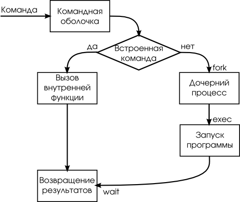
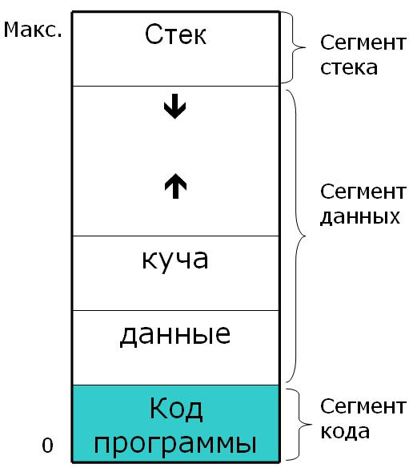
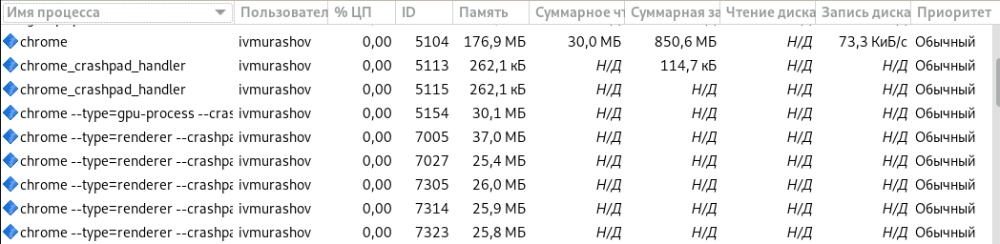
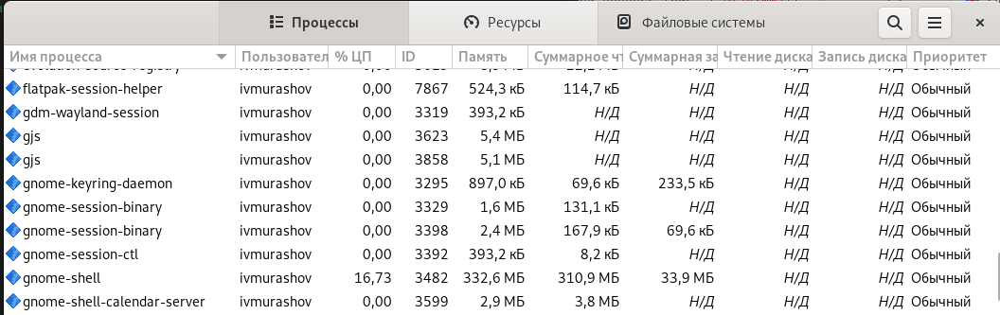
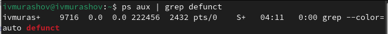
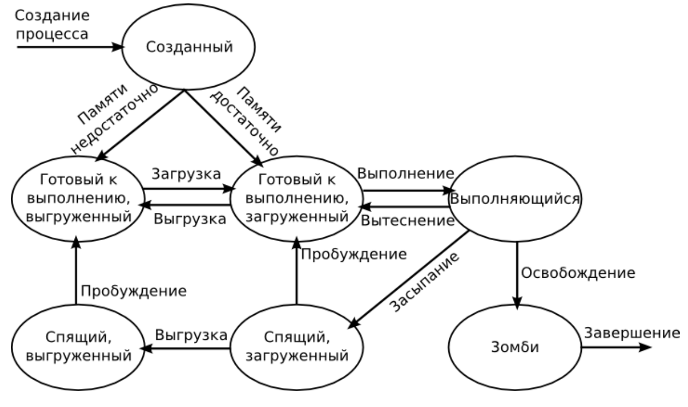

---
## Front matter
title: "Индивидуальный доклад по теме <<Понятие процесса, виды процессов и его состояния в операционных системах>>"
subtitle: "Операционные системы"
author: "Мурашов Иван Вячеславович"

## Generic otions
lang: ru-RU
toc-title: "Содержание"

## Bibliography
bibliography: bib/cite.bib
csl: pandoc/csl/gost-r-7-0-5-2008-numeric.csl

## Pdf output format
toc: true # Table of contents
toc-depth: 2
lof: true # List of figures
lot: true # List of tables
fontsize: 12pt
linestretch: 1.5
papersize: a4
documentclass: scrreprt

## I18n polyglossia
polyglossia-lang:
  name: russian
  options:
	- spelling=modern
	- babelshorthands=true
polyglossia-otherlangs:
  name: english
  
## I18n babel
babel-lang: russian
babel-otherlangs: english

## Fonts
mainfont: PT Serif
romanfont: PT Serif
sansfont: PT Sans
monofont: PT Mono
mainfontoptions: Ligatures=TeX
romanfontoptions: Ligatures=TeX
sansfontoptions: Ligatures=TeX,Scale=MatchLowercase
monofontoptions: Scale=MatchLowercase,Scale=0.9

## Biblatex
biblatex: true
biblio-style: "gost-numeric"
biblatexoptions:
  - parentracker=true
  - backend=biber
  - hyperref=auto
  - language=auto
  - autolang=other*
  - citestyle=gost-numeric
  
## Pandoc-crossref LaTeX customization
figureTitle: "Рис."
tableTitle: "Таблица"
listingTitle: "Листинг"
lofTitle: "Список иллюстраций"
lotTitle: "Список таблиц"
lolTitle: "Листинги"

## Misc options
indent: true
header-includes:
  - \usepackage{indentfirst}
  - \usepackage{float} # keep figures where there are in the text
  - \floatplacement{figure}{H} # keep figures where there are in the text
---

# Цель работы

Целью данного исследования является приобретение знаний по теме "Понятие процесса, виды процессов и его состояния в операционных системах" и составление содержательного доклада по данной теме.

# Понятие процесса

Процесс - это программа или команда, выполняемая на компьютере. С помощью команд вы сообщаете операционной системе, какую задачу ей следует выполнить. Введенные команды расшифровываются интерпретатором команд, (называемым оболочкой), после чего задача выполняется (рис. [-@fig:001]).

{#fig:001 width=70%}

## Ресурсы, которыми владеет процесс

Обычно процесс в вычислительной системе представлен (также говорят, «владеет») следующими ресурсами:

- образом исполняемого машинного кода, ассоциированного с программой;
- памятью (обычно некоторой областью виртуальной памяти), которая включает в себя:
    - исполняемый код;
    - входные и выходные данные процесса;
    - стек вызовов (для отслеживания активных подпрограмм);
    - кучу (хип) для хранения промежуточных результатов вычислений, генерируемых во время выполнения;
- дескрипторами ресурсов операционной системы, выделенными для процесса, например, файл
- файловыми дескрипторами;
- атрибутами безопасности, такими как владелец и набор полномочий процесса (допустимых операций);
- состоянием процессора (контекстом), таким как:
    - содержимое регистров;
    - схема преобразования виртуальных адресов в физические;
    - и т. д.
Контекст текущего процесса выгружается в память, когда выполняется переключение на другой процесс (рис. [-@fig:002]).

{#fig:002 width=70%}

# Виды процессов

## Интерактивные и фоновые процессы

Интерактивными называются процессы, которые запускаются пользователем, и те процессы, в работе которых принимает участие пользователь. Процессы, выполняемые независимо от пользователя, называются фоновыми. По умолчанию программы и команды выполняются как интерактивные процессы (рис. [-@fig:003]).

{#fig:003 width=70%}

## Демоны

Демоны - это процессы, выполняемые автономно. Они постоянно работают в фоновом режиме. Обычно демоны запускаются вместе с системой и завершают работу вместе с ней. Как правило, демоны обеспечивают работу системных служб и доступны в каждый момент времени нескольким задачам и пользователям. Демоны запускаются пользователем root или оболочкой root и могут быть завершены только пользователем root. Например, демон qdaemon предоставляет доступ к системным ресурсам (принтерам и т.п.) (рис. [-@fig:004]).

{#fig:004 width=70%}

## Процессы-зомби

Процесс-зомби - это неактивный процесс, который по-прежнему находится в таблице процессов (иными словами, он сохраняет свой ID процесса). Ему не выделяется системная память. Процессы-зомби - это процессы, которые были прерваны или завершены, но продолжают существовать в таблице процессов до тех пор, не будет завершен родительский процесс или не произойдет перезагрузка системы. Процессы-зомби отображаются как <defunct> в выводе команды ps (рис. [-@fig:005]).

{#fig:005 width=70%}

# Состояния процесса

1. Порождение – состояние процесса, когда он уже создан, но не готов к запуску, при этом создаются информационные структуры, описывающие данный процесс; загружается кодовый сегмент процесса в оперативную память или в область свопинга;

2. Выполнение – активное состояние процесса, во время которого процесс обладает всеми необходимыми ресурсами и непосредственно выполняется процессором;

3. Ожидание – пассивное состояние процесса, процесс заблокирован, он не может выполняться по своим внутренним причинам, т.к. ждет осуществления некоторого события, например, завершения операции ввода-вывода, получения сообщения от другого процесса, освобождения какого-либо необходимого ему ресурса;

4. Готовность – также пассивное состояние процесса: процесс имеет все требуемые для него ресурсы, он готов выполняться, однако процессор занят выполнением другого процесса;

5. Завершение – конечное состояние в жизненном цикле процесса, процесс выгружается из памяти и разрушаются все структуры данных, связанные с ним (рис. [-@fig:006]).

{#fig:006 width=70%}

# Выводы

В операционных системах процесс представляет собой программу или задачу, которая выполняется на компьютере и владеет определёнными ресурсами. Выделяют 3 основных вида процесса: интерактивные, демоны и процессы-зомби. Каждый процесс имеет свое состояние. Выделяют 5 основных состояний процесса: порождение, выполнение, ожидание, готовность и завершение.

В ходе подготовки данного доклада мной были приобретены знания о понятии процесса, видах процесса и его состояниях в операционных системах.

# Список литературы {.unnumbered}

::: {#refs}
1. Операционные системы: взаимодействие процессов / Н.В.Вдовикина, И.В.Машечкин, А.Н.Терехин, А.Н.Томилин - Издательский отдел факультета ВМиК МГУ 2008, - 215 c.

2. Введение в администрирование UNIX / Алексей Федосеев - [Электронный ресурс](http://heap.altlinux.org/modules/unix_base_admin.dralex/)

3. Процессы / Документация IBM - [Электронный ресурс](https://www.ibm.com/docs/ru/aix/7.1?topic=processes-)

4. Процесс (информатика) / Википедия - [Электронный ресурс](https://ru.wikipedia.org/wiki/%D0%9F%D1%80%D0%BE%D1%86%D0%B5%D1%81%D1%81_%28%D0%B8%D0%BD%D1%84%D0%BE%D1%80%D0%BC%D0%B0%D1%82%D0%B8%D0%BA%D0%B0%29#%D0%9F%D1%80%D0%B5%D0%B4%D1%81%D1%82%D0%B0%D0%B2%D0%BB%D0%B5%D0%BD%D0%B8%D0%B5_%D0%BF%D1%80%D0%BE%D1%86%D0%B5%D1%81%D1%81%D0%B0_%D0%B2_%D0%BF%D0%B0%D0%BC%D1%8F%D1%82%D0%B8)

5. Понятие ПРОЦЕСС - [Электронный ресурс](http://komputercnulja.ru/operacionnye-sistemy/ponjatie-process)

6. Лекции по курсу операционные системы / Д.С. Кулябов - [Электронный ресурс](https://yamadharma.github.io/ru/course/os-intro/lection/lection03/)
:::
