---
## Front matter
lang: ru-RU
title: Отчет по этапу №1 индивидуального проекта
subtitle: Операционные системы
author:
  - Мурашов И. В.
institute:
  - Российский университет дружбы народов, Москва, Россия
date: 02 марта 2024

## i18n babel
babel-lang: russian
babel-otherlangs: english

## Formatting pdf
toc: false
toc-title: Содержание
slide_level: 2
aspectratio: 169
section-titles: true
theme: metropolis
header-includes:
 - \metroset{progressbar=frametitle,sectionpage=progressbar,numbering=fraction}
 - '\makeatletter'
 - '\beamer@ignorenonframefalse'
 - '\makeatother'
 
## Fonts
mainfont: PT Serif
romanfont: PT Serif
sansfont: PT Sans
monofont: PT Mono
mainfontoptions: Ligatures=TeX
romanfontoptions: Ligatures=TeX
sansfontoptions: Ligatures=TeX,Scale=MatchLowercase
monofontoptions: Scale=MatchLowercase,Scale=0.9
---

## Докладчик

:::::::::::::: {.columns align=center}
::: {.column width="70%"}

  * Мурашов Иван Вячеславович
  * Cтудент, 1 курс, группа НКАбд-04-23
  * Факультет физико-математических и естественных наук
  * Российский университет дружбы народов
  * [1132236018@rudn.ru](mailto:1132236018@rudn.ru)
  * <https://github.com/neve7mind>

:::
::: {.column width="30%"}

:::
::::::::::::::

## Цель работы

Целью данной лабораторной работы является приобретение навыков по размещению сайта на Github pages и выполнение 1 этапа индивидуального проекта.

## Выполнение лабораторной работы

Нахожу последнюю версию статического генератора сайтов hugo на github.

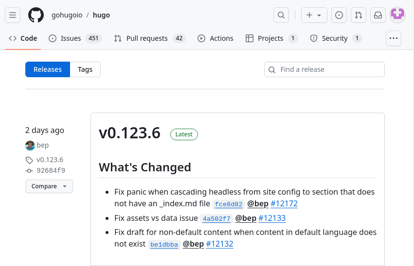

## Выполнение лабораторной работы

Скачиваю последнюю версию статического генератора сайтов hugo.

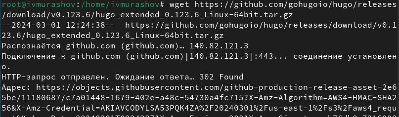

## Выполнение лабораторной работы

Распаковываю скачанный архив.

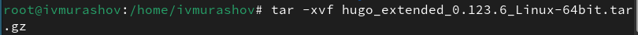

## Выполнение лабораторной работы

Устанавливаю go hugo.

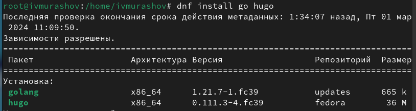

## Выполнение лабораторной работы

Создаю репозиторий на основе шаблона с темой сайта.

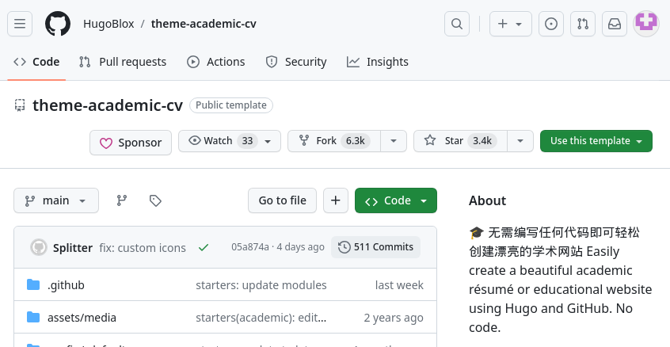

## Выполнение лабораторной работы

Клонирую репозиторий в рабочий каталог.

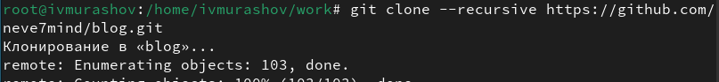

## Выполнение лабораторной работы

Запускаю исполняемый файл с помощью команды 'hugo server'.

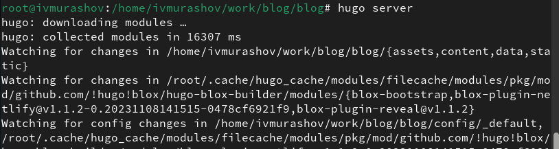

## Выполнение лабораторной работы

Получилась страничка на локальном сервере.

## Выполнение лабораторной работы

Создаю репозиторий для будущего проекта.

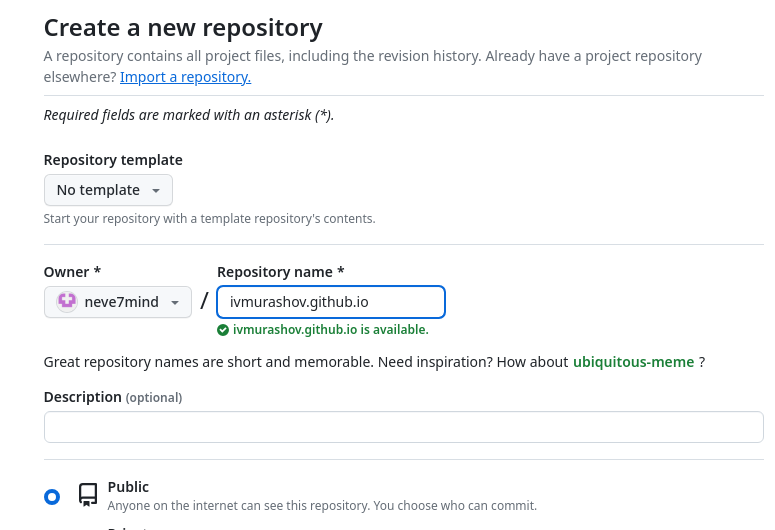

## Выполнение лабораторной работы

Клонирую репозиторий в рабочий каталог.

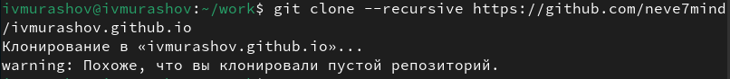

## Выполнение лабораторной работы

Создаю главную ветку (main), проверяю работоспособность созданного репозитория.

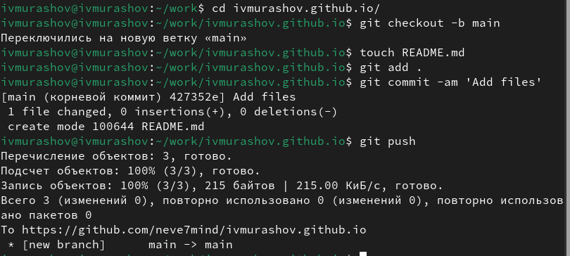

## Выполнение лабораторной работы

Комментирую строку public в файле .gitignore.

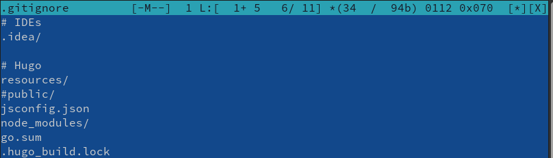

## Выполнение лабораторной работы

Подключаю к репозиторию каталог public.

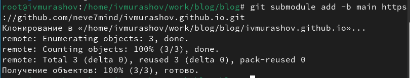

## Выполнение лабораторной работы

Выполняю команду исполняемого файла, чтобы заполнить каталог public.

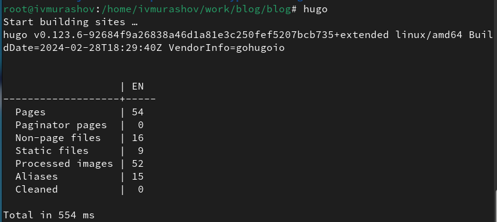

## Выполнение лабораторной работы

Отправляю файлы на сервер.

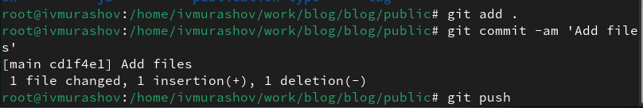

## Выводы

В ходе выполнения данной лабораторной работы я приобрел навыки по размещению сайта на Github pages и выполненил 1 этап индивидуального проекта.

