---
## Front matter
title: "Отчет по этапу №1 индивидуального проекта"
subtitle: "Операционные системы"
author: "Мурашов Иван Вячеславович"

## Generic otions
lang: ru-RU
toc-title: "Содержание"

## Bibliography
bibliography: bib/cite.bib
csl: pandoc/csl/gost-r-7-0-5-2008-numeric.csl

## Pdf output format
toc: true # Table of contents
toc-depth: 2
lof: true # List of figures
lot: true # List of tables
fontsize: 12pt
linestretch: 1.5
papersize: a4
documentclass: scrreprt
## I18n polyglossia
polyglossia-lang:
  name: russian
  options:
	- spelling=modern
	- babelshorthands=true
polyglossia-otherlangs:
  name: english
## I18n babel
babel-lang: russian
babel-otherlangs: english
## Fonts
mainfont: PT Serif
romanfont: PT Serif
sansfont: PT Sans
monofont: PT Mono
mainfontoptions: Ligatures=TeX
romanfontoptions: Ligatures=TeX
sansfontoptions: Ligatures=TeX,Scale=MatchLowercase
monofontoptions: Scale=MatchLowercase,Scale=0.9
## Biblatex
biblatex: true
biblio-style: "gost-numeric"
biblatexoptions:
  - parentracker=true
  - backend=biber
  - hyperref=auto
  - language=auto
  - autolang=other*
  - citestyle=gost-numeric
## Pandoc-crossref LaTeX customization
figureTitle: "Рис."
tableTitle: "Таблица"
listingTitle: "Листинг"
lofTitle: "Список иллюстраций"
lotTitle: "Список таблиц"
lolTitle: "Листинги"
## Misc options
indent: true
header-includes:
  - \usepackage{indentfirst}
  - \usepackage{float} # keep figures where there are in the text
  - \floatplacement{figure}{H} # keep figures where there are in the text
---

# Цель работы

Целью данной лабораторной работы является приобретение навыков по размещению сайта на Github pages и выполнение 1 этапа индивидуального проекта.

# Задание

1. Установка необходимого ПО

2. Скачивание шаблона темы сайта

3. Установка параметров для URls сайта и размещение на github

# Выполнение лабораторной работы

## Установка необходимого ПО

Нахожу последнюю версию статического генератора сайтов hugo на github (рис. [-@fig:001]).

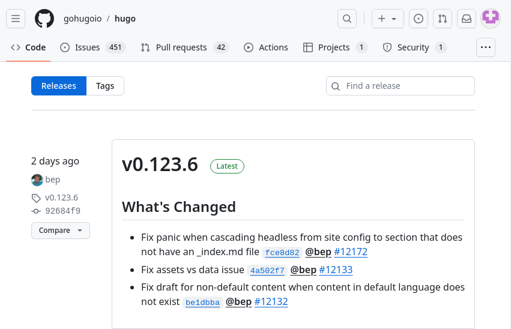{#fig:001 width=70%}

Скачиваю последнюю версию статического генератора сайтов hugo (рис. [-@fig:002]).

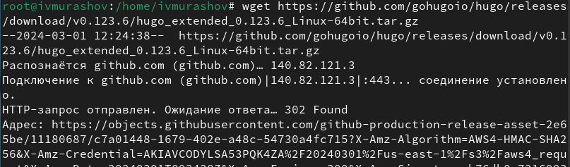{#fig:002 width=70%}

Распаковываю скачанный архив (рис. [-@fig:003]).

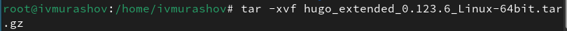{#fig:003 width=70%}

Устанавливаю go hugo (рис. [-@fig:006]).

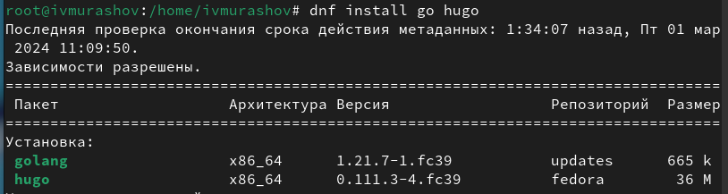{#fig:006 width=70%}

## Скачивание шаблона темы сайта

Создаю репозиторий на основе шаблона с темой сайта (рис. [-@fig:004]).

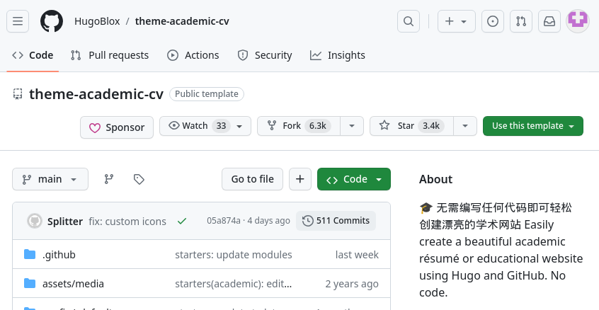{#fig:004 width=70%}

Клонирую репозиторий в рабочий каталог (рис. [-@fig:005]).

{#fig:005 width=70%}

Запускаю исполняемый файл с помощью команды 'hugo server' (рис. [-@fig:007]).

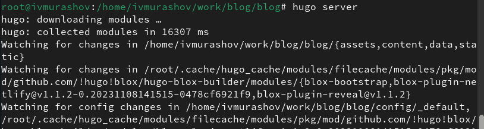{#fig:007 width=70%}

Получилась страничка на локальном сервере (рис. [-@fig:008]).

{#fig:008 width=70%}

## Установка параметров для URls сайта и размещение на github

Создаю репозиторий для будущего проекта (рис. [-@fig:009]).

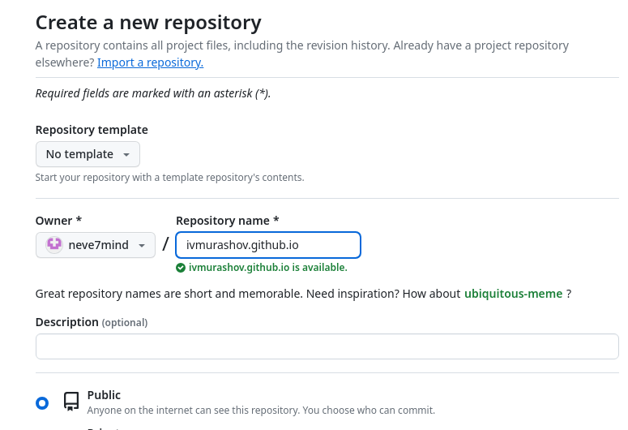{#fig:009 width=70%}

Клонирую репозиторий в рабочий каталог (рис. [-@fig:010]).

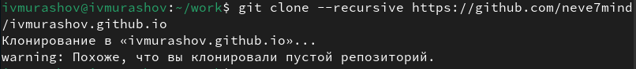{#fig:010 width=70%}

Создаю главную ветку (main), проверяю работоспособность созданного репозитория (рис. [-@fig:011]).

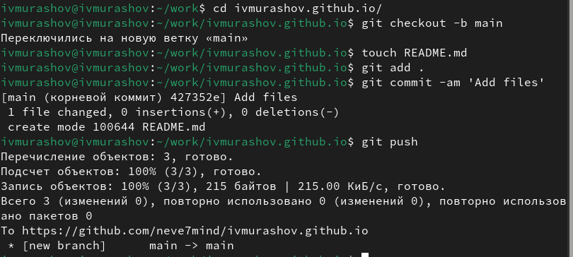{#fig:011 width=70%}

Комментирую строку public в файле .gitignore (рис. [-@fig:015]).

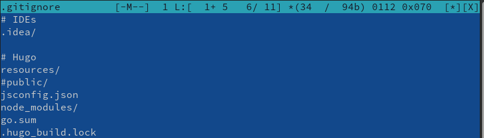{#fig:015 width=70%}

Подключаю к репозиторию каталог public (рис. [-@fig:012]).

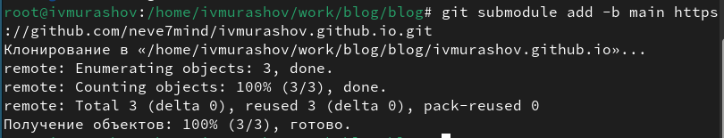{#fig:012 width=70%}

Выполняю команду исполняемого файла, чтобы заполнить каталог public (рис. [-@fig:013]).

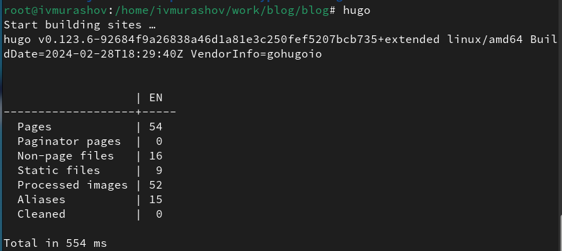{#fig:013 width=70%}

Отправляю файлы на сервер (рис. [-@fig:016]).

{#fig:016 width=70%}

# Выводы

В ходе выполнения данной лабораторной работы я приобрел навыки по размещению сайта на Github pages и выполненил 1 этап индивидуального проекта.

